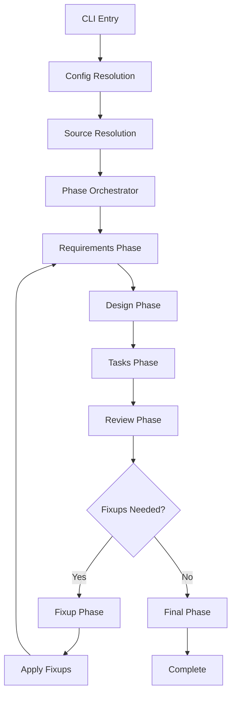
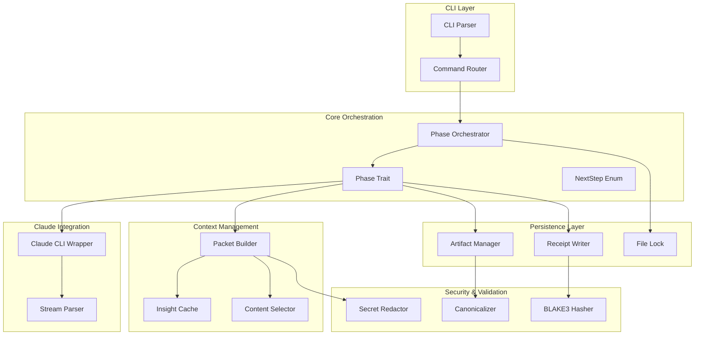

# Design Document

## Overview

xchecker is a Rust CLI tool that orchestrates spec generation workflows using the Claude CLI. The system implements a deterministic, token-efficient pipeline that transforms rough ideas into detailed implementation plans through a structured phase-based approach.

### Core Design Principles

1. **Deterministic Execution**: Same inputs produce identical canonicalized outputs with cryptographic verification
2. **Token Efficiency**: Bounded context packets with intelligent content selection and caching
3. **Phase Isolation**: Separate Claude sessions per phase with clean resumption capabilities
4. **Auditability**: Complete receipt trail with BLAKE3 hashes for all inputs and outputs
5. **Security First**: Built-in secret redaction and sandboxed execution

## Architecture

### High-Level Flow



### Component Architecture



## Components and Interfaces

### Phase Trait System

The core abstraction for all workflow phases with separated concerns:

```rust
#[derive(Debug, Clone, Copy, PartialEq, Eq, Hash)]
pub enum PhaseId {
    Requirements,
    Design,
    Tasks,
    Review,
    Fixup,
    Final,
}

pub trait Phase {
    fn id(&self) -> PhaseId;
    fn deps(&self) -> &'static [PhaseId];
    fn can_resume(&self) -> bool;
    
    // Separated concerns for better testability
    fn prompt(&self, ctx: &PhaseContext) -> String;
    fn make_packet(&self, ctx: &PhaseContext) -> anyhow::Result<Packet>;
    fn postprocess(&self, raw: &str, store: &ArtifactStore) -> anyhow::Result<PhaseResult>;
}

pub enum NextStep {
    Continue,
    Rewind { to: PhaseId },
    Complete,
}

pub struct PhaseResult {
    pub artifacts: Vec<Artifact>,
    pub next_step: NextStep,
    pub metadata: HashMap<String, String>,
}
```

### Packet Builder System

Manages token-efficient context construction with deterministic selection and concrete budgets:

```rust
pub struct PacketBuilder {
    max_bytes: usize, // default 65536 (config-overridable)
    max_lines: usize, // default 1200 (config-overridable)
    selector: ContentSelector,
    cache: InsightCache,
    redactor: SecretRedactor,
}

// Concrete defaults and behavior
pub const DEFAULT_PACKET_MAX_BYTES: usize = 65536;
pub const DEFAULT_PACKET_MAX_LINES: usize = 1200;

pub struct Packet {
    pub content: String,
    pub blake3_hash: String, // hash of redacted content
    pub evidence: PacketEvidence,
    pub budget_used: BudgetUsage,
}

pub struct PacketEvidence {
    pub files: Vec<FileEvidence>,
    pub max_bytes: usize,
    pub max_lines: usize,
}

pub struct FileEvidence {
    pub path: String,
    pub range: Option<String>, // e.g., "L1-L80"
    pub blake3_pre_redaction: String,
    pub priority: Priority,
}

pub struct ContentSelector {
    include_patterns: Vec<globset::Glob>,
    exclude_patterns: Vec<globset::Glob>,
    priority_rules: PriorityRules,
}

pub struct PriorityRules {
    // Selection order with LIFO within class:
    // 1. *.core.yaml (non-evictable) 
    // 2. SPEC/ADR/REPORT → README/SCHEMA → misc
    // 3. LIFO within priority class
    pub high: Vec<globset::Glob>, // SPEC*/ADR*/REPORT* globs
    pub medium: Vec<globset::Glob>, // README*, SCHEMA* globs  
    pub low: Vec<globset::Glob>, // misc files
}

#[derive(Debug, Clone, Copy, PartialEq, Eq, PartialOrd, Ord)]
pub enum Priority {
    Upstream, // *.core.yaml - never evicted
    High,
    Medium,
    Low,
}
```

### Receipt System

Provides complete auditability with multi-file support:

```rust
#[derive(Serialize, Deserialize)]
pub struct Receipt {
    pub spec_id: String,
    pub phase: String,
    pub timestamp: DateTime<Utc>,
    pub xchecker_version: String, // from build.rs: "{CARGO_PKG_VERSION}+{GIT_SHA}"
    pub claude_cli_version: String,
    pub model_full_name: String,
    pub model_alias: Option<String>,
    pub canonicalization_version: String, // e.g., "yaml-v1,md-v1"
    pub flags: HashMap<String, String>,
    pub runner: &'static str, // "native" | "wsl"
    pub runner_distro: Option<String>, // e.g., "Ubuntu-22.04" from wsl -l -q or $WSL_DISTRO_NAME
    pub canonicalization_backend: &'static str, // "jcs-rfc8785" for YAML hashing auditability
    pub packet: PacketEvidence,
    pub outputs: Vec<FileHash>,
    pub exit_code: i32,
    pub stderr_tail: Option<String>, // ≤2 KiB
    pub warnings: Vec<String>,
    pub fallback_used: bool, // true if stream-json → text fallback occurred
}

#[derive(Serialize, Deserialize)]
pub struct FileHash {
    pub path: String,
    pub blake3_canonicalized: String,
}

// Example JSON structure:
// {
//   "spec_id": "153",
//   "phase": "DESIGN", 
//   "timestamp": "2025-09-30T20:05:12Z",
//   "xchecker_version": "0.1.0",
//   "claude_cli_version": "0.8.1",
//   "model_full_name": "claude-sonnet-4-5-20250929",
//   "canonicalization_version": "yaml-v1,md-v1",
//   "flags": {"max_turns": "6", "output_format": "stream-json"},
//   "packet": {
//     "files": [
//       {"path": "artifacts/00-requirements.core.yaml", "blake3_pre_redaction": "abc123", "priority": "Upstream"},
//       {"path": "docs/ADR-001.md", "range": "L1-L80", "blake3_pre_redaction": "def456", "priority": "High"}
//     ],
//     "max_bytes": 65536,
//     "max_lines": 1200
//   },
//   "outputs": [
//     {"path": "artifacts/10-design.md", "blake3_canonicalized": "xyz789"},
//     {"path": "artifacts/10-design.core.yaml", "blake3_canonicalized": "uvw012"}
//   ],
//   "exit_code": 0,
//   "stderr_tail": "",
//   "warnings": []
// }
```

### Artifact Management

Handles file lifecycle with atomic operations:

```rust
pub struct ArtifactManager {
    base_path: PathBuf,
    lock: FileLock,
}

pub struct Artifact {
    pub name: String,
    pub content: String,
    pub artifact_type: ArtifactType,
    pub blake3_hash: String,
}

pub enum ArtifactType {
    Markdown,
    CoreYaml,
    Partial,
    Context,
}
```

### Runner Abstraction (Windows/WSL Support)

Provides cross-platform Claude CLI execution with automatic detection:

```rust
#[derive(Debug, Clone, Copy, PartialEq, Eq)]
pub enum RunnerMode {
    Auto,
    Native,
    Wsl,
}

pub struct WslOptions {
    pub distro: Option<String>,
    pub claude_path: Option<String>,
}

pub struct Runner {
    pub mode: RunnerMode,
    pub wsl_options: WslOptions,
}

impl Runner {
    pub fn detect_auto() -> Result<RunnerMode, RunnerError> {
        // On Windows:
        // 1. Try claude --version on PATH → Native if succeeds
        // 2. Else try wsl -e claude --version → Wsl if returns 0
        // 3. Else: friendly preflight error suggesting wsl --install if needed
        // On Linux/macOS: always Native
        // Record runner_distro from wsl -l -q or $WSL_DISTRO_NAME for WSL
    }
    
    pub fn execute_claude(&self, args: &[String], stdin: &str) -> Result<ClaudeResponse, RunnerError> {
        match self.mode {
            RunnerMode::Native => {
                // spawn claude directly
            }
            RunnerMode::Wsl => {
                // Use wsl.exe --exec for execution (no shell needed for piping stdin)
                // Only use shell (bash -lc) for detection that requires shell builtins
                // STDIN pass-through from Windows to WSL command is supported
            }
        }
    }
}
```

### Claude CLI Integration

Wraps Claude CLI with controlled surface and fallback handling:

```rust
pub struct ClaudeWrapper {
    model_alias: Option<String>,
    model_full_name: String, // resolved once per run
    max_turns: u32,
    allowed_tools: Vec<String>,
    disallowed_tools: Vec<String>,
    permission_mode: Option<PermissionMode>,
    claude_cli_version: String, // captured from `claude --version`
    runner: Runner,
}

#[derive(Debug, Clone)]
pub enum PermissionMode {
    Plan,
    Auto,
    Block,
}

pub struct ClaudeResponse {
    pub content: String,
    pub metadata: ResponseMetadata,
    pub stderr: String,
    pub exit_code: i32,
    pub output_format: OutputFormat,
}

#[derive(Debug, Clone)]
pub enum OutputFormat {
    StreamJson,
    Text, // fallback
}

impl ClaudeWrapper {
    pub async fn execute(&self, prompt: &str) -> Result<ClaudeResponse, ClaudeError> {
        // Always try --output-format stream-json --include-partial-messages first
        // On parse failure, retry once with --output-format text
        // Capture stderr_tail (2 KiB max) and partial stdout on non-zero exit
    }
    
    pub fn resolve_model_name(&mut self) -> Result<(), ClaudeError> {
        // Resolve model alias to full name once per run
        // Record both alias and resolved name
    }
}
```

## Data Models

### Configuration Model

```rust
#[derive(Deserialize)]
pub struct Config {
    pub defaults: Defaults,
    pub selectors: Selectors,
    pub runner: RunnerConfig,
}

#[derive(Deserialize)]
pub struct Defaults {
    pub model: Option<String>,
    pub max_turns: Option<u32>,
    pub packet_max_bytes: Option<usize>, // default 65536
    pub packet_max_lines: Option<usize>, // default 1200
}

#[derive(Deserialize)]
pub struct Selectors {
    pub include: Vec<String>, // e.g., ["docs/**/SPEC*.md", "docs/**/ADR*.md", "README.md", "SCHEMASET.*", "**/Cargo.toml"]
    pub exclude: Vec<String>, // e.g., ["target/**", "node_modules/**"]
}

#[derive(Deserialize)]
pub struct RunnerConfig {
    pub mode: Option<String>, // "auto"|"native"|"wsl"
    pub distro: Option<String>, // optional WSL distro
    pub claude_path: Option<String>, // optional absolute path in WSL
}

// Discovery and precedence
impl Config {
    pub fn discover() -> Result<Config, ConfigError> {
        // Search from CWD upward for .xchecker/config.toml
        // Stop at filesystem root or repository root
        // Allow explicit --config <path> override
    }
    
    pub fn effective_config(cli_args: &CliArgs) -> EffectiveConfig {
        // Precedence: CLI > config > defaults
        // Track source of each setting for status display
    }
}
```

### Source Resolution Model

```rust
pub enum SourceType {
    GitHub { owner: String, repo: String },
    FileSystem { path: PathBuf },
    Stdin,
}

pub struct SourceContext {
    pub source_type: SourceType,
    pub content: String,
    pub metadata: HashMap<String, String>,
}
```

### Canonicalization Model

Provides deterministic normalization with explicit v1 algorithms:

```rust
pub struct Canonicalizer {
    version: String, // e.g., "yaml-v1,md-v1"
}

// Canonicalization version constants
pub const CANON_VERSION_YAML: &str = "yaml-v1";
pub const CANON_VERSION_MD: &str = "md-v1";
pub const CANON_VERSION: &str = concat!(CANON_VERSION_YAML, ",", CANON_VERSION_MD);
pub const CANONICALIZATION_BACKEND: &str = "jcs-rfc8785"; // for YAML hashing

impl Canonicalizer {
    pub fn canonicalize_yaml(&self, content: &str) -> Result<String, CanonError> {
        // YAML canonicalization (v1) for hashing - JCS approach:
        // 1. Parse YAML → convert to serde_json::Value with deterministic maps (BTreeMap)
        // 2. Serialize using RFC 8785 JCS → hash the canonical JSON
        // 3. Store JCS hash as "canonicalized hash" for YAML
        // 4. Keep human-readable YAML on disk (normalized: LF, trim trailing spaces, final newline)
        // 5. Do not rely on YAML emitter details for determinism
    }
    
    pub fn normalize_markdown(&self, content: &str) -> Result<String, CanonError> {
        // Markdown normalization (v1) - explicit rules:
        // 1. Normalize \n, trim trailing spaces, collapse trailing blank lines to 1
        // 2. Fence normalization: ``` with language tag preserved
        // 3. Final newline enforced
        // 4. Normalize heading underlines to # style
        // 5. Stable ordering where structure allows
    }
    
    pub fn hash_canonicalized(&self, content: &str, file_type: FileType) -> Result<String, CanonError> {
        let normalized = match file_type {
            FileType::Yaml => self.canonicalize_yaml(content)?,
            FileType::Markdown => self.normalize_markdown(content)?,
            FileType::Text => content.replace("\r\n", "\n").replace("\r", "\n"),
        };
        Ok(blake3::hash(normalized.as_bytes()).to_hex().to_string())
    }
}

#[derive(Debug, Clone, Copy)]
pub enum FileType {
    Yaml,
    Markdown, 
    Text,
}
```

## Error Handling

### Error Hierarchy

```rust
#[derive(Error, Debug)]
pub enum XCheckerError {
    #[error("Configuration error: {0}")]
    Config(#[from] ConfigError),
    
    #[error("Phase execution error: {0}")]
    Phase(#[from] PhaseError),
    
    #[error("Claude CLI error: {0}")]
    Claude(#[from] ClaudeError),
    
    #[error("Runner error: {0}")]
    Runner(#[from] RunnerError),
    
    #[error("IO error: {0}")]
    Io(#[from] std::io::Error),
    
    #[error("Secret detected: {pattern_id} in {location}")]
    SecretDetected { pattern_id: String, location: String },
    
    #[error("Packet overflow: {used_bytes} bytes, {used_lines} lines > limits {limit_bytes} bytes, {limit_lines} lines")]
    PacketOverflow { used_bytes: usize, used_lines: usize, limit_bytes: usize, limit_lines: usize },
    
    #[error("Concurrent execution detected for spec {id} (PID {pid})")]
    ConcurrentExecution { id: String, pid: u32 },
    
    #[error("Canonicalization failed in {phase}: {reason}")]
    CanonicalizationFailed { phase: String, reason: String },
    
    #[error("Model resolution error: alias '{alias}' -> {reason}")]
    ModelResolutionError { alias: String, reason: String },
}
```

### Failure Recovery

1. **Partial Artifacts**: On non-zero exit, write .partial.md, include stderr_tail (≤2 KiB) and warnings in receipt; stop flow
2. **Receipt Integrity**: All failures recorded with exit codes and stderr tails  
3. **Resume Capability**: On successful rerun, delete partial and promote final; resume --phase does not mutate earlier receipts/artifacts unless rewind triggered
4. **Atomic Operations**: All file writes use tempfile+rename pattern with Windows retry logic for transient AV/indexer locks

## Testing Strategy

### Unit Testing

1. **Phase Isolation**: Each phase tested independently with mock dependencies
2. **Canonicalization**: Extensive testing of YAML/markdown normalization
3. **Packet Building**: Budget enforcement and content selection validation
4. **Secret Redaction**: Pattern matching and false positive prevention

### Integration Testing

1. **End-to-End Flows**: Complete spec generation workflows
2. **Resume Scenarios**: Phase failure and recovery testing
3. **Determinism Validation**: Same inputs producing identical outputs
4. **Claude CLI Integration**: Mock and real Claude CLI interactions

### Property-Based Testing

1. **Canonicalization Properties**: Structure preservation across transformations
2. **Hash Consistency**: BLAKE3 stability across equivalent inputs  
3. **Budget Enforcement**: Packet size constraints under various inputs
4. **Determinism Validation**: Same inputs producing identical canonicalized outputs

### Golden Pipeline Testing

**Claude CLI Stub Scenarios:**
- Valid stream-json output with complete messages
- Truncated events and partial messages
- Malformed JSON requiring text fallback
- Plain text output mode
- Various exit codes and stderr patterns

**Specific Test Cases:**
- **Determinism**: Canonicalize two outputs with different whitespace/order → same hash
- **Budget**: Craft inputs exceeding bytes vs lines vs both limits independently
- **Redaction**: Ensure matches abort; non-matches pass; redacted packet differs from raw
- **Evidence**: Verify receipts maintain per-file pre-redaction hashes
- **Selection**: Test priority-based eviction with stable ordering

### Performance Testing

1. **Empty Run Benchmarks**: Sub-5s execution without Claude calls
2. **Packetization Speed**: Sub-200ms for 100-file projects
3. **Memory Usage**: Bounded memory consumption during large project processing

## Determinism and Canonicalization

### Canonicalization Algorithms

**YAML Canonicalization (v1):**
1. Parse YAML structure using serde_yaml
2. Emit with normalized formatting:
   - `\n` newlines only (no `\r\n` or `\r`)
   - UTF-8 encoding
   - Sorted mapping keys (recursive through all nested structures)
   - No trailing spaces on any line
   - Final newline at end of file
3. Strip all comments and preserve only structure
4. Fold multi-line scalars to `|` style with `\n` separators
5. Deterministic ordering of all collections (maps sorted by key, sequences preserved)

**Markdown Normalization (v1):**
1. Normalize line endings to `\n`
2. Collapse multiple trailing blank lines to exactly 1
3. Trim trailing spaces from all lines
4. Enforce fenced code blocks as ``` with language tag preserved if present
5. Normalize heading underlines (convert to # style)
6. Ensure file ends with exactly one `\n`
7. Stable ordering of elements where structure allows

### Determinism Guarantees

**Input Equivalence Definition:**
- Identical packet BLAKE3 hash (post-redaction)
- Identical phase prompt text
- Identical model full name and CLI version
- Identical flags (sorted by key for comparison)

**Output Determinism:**
- Same inputs → identical canonicalized outputs
- BLAKE3 hashes computed over canonicalized content only
- Canonicalization version recorded in all receipts
- Structure determinism, not verbatim text matching

### Hash Chain Integrity


## Fixup System

### Preview vs Apply Modes

The fixup system operates in two distinct modes to provide safety and control:

```rust
pub enum FixupMode {
    Preview, // Default: parse & validate unified diffs, list targets, no writes
    Apply,   // Gated by --apply-fixups: run git apply --check first, then apply
}

pub struct FixupParser {
    pub mode: FixupMode,
}

impl FixupParser {
    pub fn parse_diffs(&self, content: &str) -> Result<Vec<UnifiedDiff>, FixupError> {
        // Parse fenced ```diff blocks with ---/+++ headers
        // Validate diff format and collect target files
        // Return structured diff representation
    }
    
    pub fn preview_changes(&self, diffs: &[UnifiedDiff]) -> FixupPreview {
        // List planned edits without applying
        // Show target files and change summary
        // Record in receipt for audit trail
    }
    
    pub fn apply_changes(&self, diffs: &[UnifiedDiff]) -> Result<FixupResult, FixupError> {
        // Gate: only if mode == Apply
        // Run git apply --check against temp copy first for validation
        // Capture diagnostics into warnings in receipt
        // Consider --3way as last resort; record usage in receipt for audit trail
        // Apply changes and list applied files in receipt
    }
}

pub struct UnifiedDiff {
    pub target_file: String,
    pub hunks: Vec<DiffHunk>,
}

pub struct FixupResult {
    pub applied_files: Vec<String>,
    pub warnings: Vec<String>,
}
```

**Default Behavior:**
- All fixup operations default to preview mode
- Status command shows intended targets before application
- `--apply-fixups` flag required for actual file modification
- Git apply --check validation before any writes

## Security Considerations

### Secret Redaction

**Default Patterns:**
- GitHub tokens: `ghp_[A-Za-z0-9]{36}`
- AWS access keys: `AKIA[0-9A-Z]{16}`
- AWS secret keys: `AWS_SECRET_ACCESS_KEY[=:]`
- Slack tokens: `xox[baprs]-[A-Za-z0-9-]+`
- Bearer tokens: `Bearer [A-Za-z0-9._-]{20,}`

**Configuration:**
- `--ignore-secret-pattern <regex>`: Suppress detection of specific pattern
- `--extra-secret-pattern <regex>`: Add additional pattern to detect
- **Fail-Safe**: Any detection aborts run unless explicitly ignored
- **Audit Trail**: Receipt logs pattern and location (filename+range), never matched text

**Processing Order:**
1. Scan files for secret patterns before packet construction
2. Apply redaction to packet content
3. Compute packet BLAKE3 hash on redacted content
4. Store pre-redaction file hashes in packet evidence

### Sandboxing

- **Project Scope**: Default restriction to project tree
- **External Access**: Explicit opt-in required for external paths
- **Environment Isolation**: No environment variables in receipts

### Audit Trail

- **Complete Traceability**: Every operation recorded with cryptographic hashes
- **Tamper Detection**: BLAKE3 verification of all artifacts
- **Version Tracking**: CLI version and canonicalization version in all receipts

## Performance Optimizations

### Caching Strategy

1. **Insight Cache**: BLAKE3-keyed caching of file summaries
2. **Artifact Reuse**: Skip regeneration of unchanged upstream artifacts
3. **Incremental Processing**: Only process changed files in resume scenarios

### Memory Management

1. **Streaming Processing**: Large files processed in chunks
2. **Bounded Buffers**: Packet size limits prevent memory exhaustion
3. **Lazy Loading**: Artifacts loaded on-demand during phase execution

### Concurrency

1. **File Locking**: Exclusive locks prevent concurrent spec execution
2. **Parallel Hashing**: BLAKE3 computation parallelized where possible
3. **Async I/O**: Non-blocking file operations throughout

## Deployment and Operations

### Installation

- **Cargo Distribution**: Published as standard Rust crate
- **Binary Releases**: Pre-built binaries for major platforms
- **Claude CLI Dependency**: Runtime dependency on Claude CLI installation

### Configuration Management

**Discovery Process:**
1. Search from CWD upward for `.xchecker/config.toml`
2. Stop at filesystem root or repository root
3. Allow explicit `--config <path>` override

**Precedence Order:**
1. CLI flags (highest priority)
2. Config file values
3. Built-in defaults (lowest priority)

**Validation and Reporting:**
- Validate configuration on load with helpful error messages
- `xchecker status` shows effective configuration with source attribution
- Emit helpful diffs showing what came from where

**File Locking:**
- Exclusive file lock at `.xchecker/specs/<id>/.lock` using fd-lock
- Second process attempting same spec exits with code 9
- All writes use tempfile → rename for atomicity

### Monitoring and Observability

**Performance Targets (NFRs):**
- Empty run ≤ 5s
- Packetize ≤ 200 ms for 100 files (P50)
- Record timings in receipts (optional) and print in --verbose

**Observability Features:**
- **Verbose Logging**: Detailed operation logs with `--verbose` flag showing selected files, sizes, hashes (no secrets ever logged)
- **Status Reporting**: Rich status information via `xchecker status` with effective config and source attribution
- **Performance Metrics**: Built-in timing and resource usage tracking
- **Atomic Operations**: All writes use tempfile→rename for consistency
- **File Locking**: Exclusive FS lock per <id>; stale lock override with --force after threshold