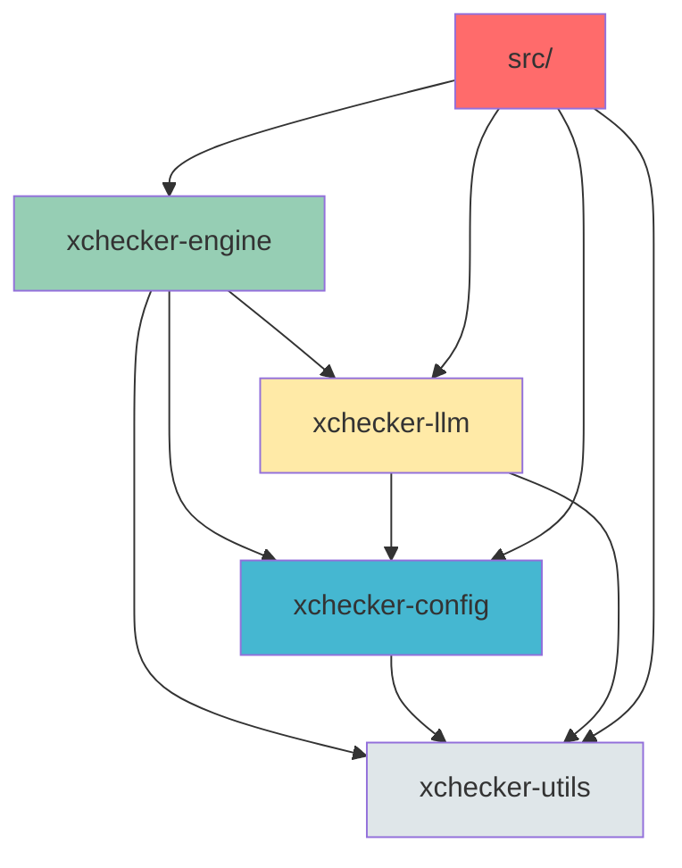
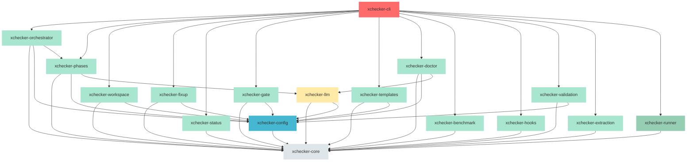

# xchecker Modularization Report

**Document Version**: 4.0
**Date**: 2026-01-17
**Project**: xchecker
**Current Version**: 1.0.0
**Rust Edition**: 2024

---

## Executive Summary

xchecker is a Rust-based CLI tool for orchestrating spec generation workflows with AI language models. The codebase has already been partially modularized into four crates (`xchecker-utils`, `xchecker-config`, `xchecker-llm`, `xchecker-engine`) with a main `src/` directory containing the CLI layer. This report provides a comprehensive analysis of the current architecture and recommends further modularization to improve maintainability, testing, and code organization.

**Key Findings:**
- Clean dependency hierarchy with no circular dependencies
- CLI layer is tightly coupled and very large (5471 lines in [`cli.rs`](../src/cli.rs:1))
- Engine crate contains multiple distinct subsystems that could be extracted
- Runner module is well-abstracted but embedded in xchecker-utils

**Recommendations:**
- Create 15 additional crates for better separation of concerns
- Extract CLI, TUI, and error reporting into dedicated crate
- Split engine crate into domain-specific crates
- Establish clear dependency hierarchy from foundation to application layers

---

## 1. Current Structure

### 1.1 Existing Crate Architecture

The xchecker project is currently organized as a Cargo workspace with the following crates:

| Crate | Purpose | Dependencies |
|-------|---------|--------------|
| **xchecker-utils** | Foundation layer with zero external dependencies | None (internal) |
| **xchecker-config** | Configuration management | xchecker-utils |
| **xchecker-llm** | Multi-provider LLM backend abstraction | xchecker-utils, xchecker-config |
| **xchecker-engine** | Core orchestration, phase execution, spec management | xchecker-utils, xchecker-config, xchecker-llm |

### 1.2 xchecker-utils (Foundation Layer)

**Location**: [`crates/xchecker-utils/`](../crates/xchecker-utils/)

**Purpose**: Foundation utilities with zero external dependencies

**Modules**:
- `atomic_write` - Atomic file operations
- `cache` - Artifact caching
- `canonicalization` - JCS (RFC 8785) JSON canonicalization
- `error` - Error types
- `exit_codes` - Exit code constants
- `logging` - Structured logging setup
- `paths` - Path utilities and sandboxing
- `redaction` - Secret detection and redaction
- `ring_buffer` - Bounded buffers
- `runner/` - Process execution abstraction (6 files)
- `source` - Source file operations
- `spec_id` - Spec ID handling
- `types` - Shared type definitions

**Key Observation**: The `runner/` module is well-abstracted but embedded in the utils crate. It could be extracted as a standalone crate for better separation of concerns.

### 1.3 xchecker-config (Configuration Layer)

**Location**: [`crates/xchecker-config/`](../crates/xchecker-config/)

**Purpose**: Configuration management with validation and precedence handling

**Dependencies**: xchecker-utils

**Key Observation**: Clean dependency on foundation layer only. Well-encapsulated configuration domain.

### 1.4 xchecker-llm (LLM Integration Layer)

**Location**: [`crates/xchecker-llm/`](../crates/xchecker-llm/)

**Purpose**: Multi-provider LLM backend abstraction

**Dependencies**: xchecker-utils, xchecker-config

**Key Observation**: Well-designed trait-based abstraction supporting multiple providers (Anthropic, OpenRouter, Claude CLI, Gemini CLI).

### 1.5 xchecker-engine (Core Orchestration Layer)

**Location**: [`crates/xchecker-engine/`](../crates/xchecker-engine/)

**Purpose**: Core orchestration, phase execution, spec management

**Dependencies**: xchecker-utils, xchecker-config, xchecker-llm

**Key Observation**: Contains multiple distinct subsystems that could be extracted into separate crates:
- Orchestrator
- Phases
- Fixup
- Workspace
- Gate
- Templates
- Doctor
- Benchmark
- Hooks
- Validation
- Extraction
- Status

### 1.6 Main src/ Directory (Application Layer)

**Location**: [`src/`](../src/)

**Purpose**: Binary entry point and CLI layer

**Files**:
- [`main.rs`](../src/main.rs:1) - Binary entry point
- [`lib.rs`](../src/lib.rs:1) - Public API facade
- [`cli.rs`](../src/cli.rs:1) - CLI command orchestration (5471 lines)
- [`tui.rs`](../src/tui.rs:1) - Terminal UI (822 lines)
- [`error_reporter.rs`](../src/error_reporter.rs:1) - Error reporting utilities (1223 lines)
- [`bin/`](../src/bin/) - Development tools

**Key Observation**: CLI is tightly coupled and very large. TUI is loosely coupled and could be extracted separately.

---

## 2. Dependency Analysis

### 2.1 Current Dependency Graph



### 2.2 Dependency Characteristics

| Characteristic | Finding |
|----------------|---------|
| **Circular Dependencies** | None - clean hierarchy |
| **Foundation Layer** | xchecker-utils has no internal dependencies |
| **Configuration Layer** | Depends only on foundation |
| **LLM Layer** | Depends on foundation and configuration |
| **Engine Layer** | Depends on all lower layers |
| **Application Layer** | Depends on all crates |

---

## 3. Findings

### 3.1 Key Observations

#### Finding 1: No Circular Dependencies
**Status**: ✅ Positive

The codebase has a clean dependency hierarchy with no circular dependencies. This makes further modularization straightforward and safe.

#### Finding 2: CLI is Tightly Coupled and Very Large
**Status**: ⚠️ Issue

The [`cli.rs`](../src/cli.rs:1) file contains 5471 lines of tightly coupled CLI logic. This makes:
- Testing difficult
- Code navigation challenging
- Feature additions risky
- Maintenance burden high

**Recommendation**: Extract CLI into dedicated crate with sub-modules.

#### Finding 3: TUI is Loosely Coupled
**Status**: ✅ Positive

The [`tui.rs`](../src/tui.rs:1) file (822 lines) is loosely coupled and could be extracted as a separate crate or kept with CLI.

#### Finding 4: Runner is Well-Abstracted but Embedded
**Status**: ⚠️ Opportunity

The `runner/` module in xchecker-utils is well-abstracted with clean interfaces. It could be extracted as a standalone crate for:
- Better separation of concerns
- Independent testing
- Potential reuse in other projects

#### Finding 5: Engine Contains Multiple Distinct Subsystems
**Status**: ⚠️ Opportunity

The xchecker-engine crate contains multiple distinct subsystems:
- **Orchestrator**: Workflow orchestration
- **Phases**: Phase execution engine
- **Fixup**: Fixup detection and application
- **Workspace**: Multi-spec management
- **Gate**: CI/CD gate enforcement
- **Templates**: Template management
- **Doctor**: Health diagnostics
- **Benchmark**: Performance benchmarking
- **Hooks**: Hook system
- **Validation**: Validation logic
- **Extraction**: Content extraction
- **Status**: Status queries

**Recommendation**: Extract these into separate crates for better organization and independent development.

### 3.2 Code Size Analysis

| File/Module | Lines | Location | Issue |
|-------------|-------|----------|-------|
| [`cli.rs`](../src/cli.rs:1) | 5471 | src/ | Very large, tightly coupled |
| [`error_reporter.rs`](../src/error_reporter.rs:1) | 1223 | src/ | Large, could be extracted |
| [`tui.rs`](../src/tui.rs:1) | 822 | src/ | Moderate size, loosely coupled |

---

## 4. Recommendations

### 4.1 Proposed New Crates

The following 15 new crates are recommended to improve code organization:

| # | Crate | Source | Purpose | Dependencies |
|---|-------|--------|---------|--------------|
| 1 | **xchecker-cli** | src/cli.rs, src/tui.rs, src/error_reporter.rs | CLI, TUI, error reporting | All other crates |
| 2 | **xchecker-runner** | crates/xchecker-utils/src/runner/ | Process execution abstraction | xchecker-utils |
| 3 | **xchecker-workspace** | crates/xchecker-engine/src/workspace.rs | Multi-spec management | xchecker-core, xchecker-config |
| 4 | **xchecker-fixup** | crates/xchecker-engine/src/fixup.rs | Fixup detection and application | xchecker-core, xchecker-config |
| 5 | **xchecker-core** | Split from xchecker-utils | Core utilities only | None |
| 6 | **xchecker-orchestrator** | crates/xchecker-engine/src/orchestrator/ | Workflow orchestration | xchecker-core, xchecker-config, xchecker-phases |
| 7 | **xchecker-phases** | crates/xchecker-engine/src/phases.rs | Phase execution engine | xchecker-core, xchecker-config, xchecker-llm |
| 8 | **xchecker-status** | crates/xchecker-engine/src/status/ | Status queries | xchecker-core |
| 9 | **xchecker-gate** | crates/xchecker-engine/src/gate/ | CI/CD gate enforcement | xchecker-core, xchecker-config |
| 10 | **xchecker-templates** | crates/xchecker-engine/src/template.rs | Template management | xchecker-core, xchecker-config |
| 11 | **xchecker-doctor** | crates/xchecker-engine/src/doctor/ | Health diagnostics | xchecker-core, xchecker-config, xchecker-llm |
| 12 | **xchecker-benchmark** | crates/xchecker-engine/src/benchmark/ | Performance benchmarking | xchecker-core |
| 13 | **xchecker-hooks** | crates/xchecker-engine/src/hooks.rs | Hook system | xchecker-core |
| 14 | **xchecker-validation** | crates/xchecker-engine/src/validation.rs | Validation logic | xchecker-core, xchecker-config |
| 15 | **xchecker-extraction** | crates/xchecker-engine/src/extraction.rs | Content extraction | xchecker-core |

### 4.2 Crate Rationale

#### 1. xchecker-cli
**Rationale**: The CLI layer is currently tightly coupled and very large (5471 lines). Extracting it into a dedicated crate will:
- Enable better testing of CLI logic
- Allow independent development of CLI features
- Provide clear separation between application and library layers
- Make it easier to add alternative frontends (GUI, web, etc.)

**Components**:
- [`cli.rs`](../src/cli.rs:1) - CLI command orchestration
- [`tui.rs`](../src/tui.rs:1) - Terminal UI
- [`error_reporter.rs`](../src/error_reporter.rs:1) - Error reporting utilities

#### 2. xchecker-runner
**Rationale**: The runner module is well-abstracted but embedded in xchecker-utils. Extracting it will:
- Provide clear separation of process execution concerns
- Enable independent testing of runner logic
- Make it easier to add new runner types
- Allow potential reuse in other projects

**Components**:
- `runner/` - Process execution abstraction (6 files)

#### 3. xchecker-workspace
**Rationale**: Workspace management is a distinct domain that could benefit from:
- Independent testing of multi-spec workflows
- Clear separation from core orchestration
- Easier addition of workspace-specific features

**Components**:
- `workspace.rs` - Multi-spec management

#### 4. xchecker-fixup
**Rationale**: Fixup logic is complex and could be extracted for:
- Independent testing of fixup detection and application
- Clear separation from phase execution
- Easier addition of new fixup strategies

**Components**:
- `fixup.rs` - Fixup detection and application

#### 5. xchecker-core
**Rationale**: Splitting xchecker-utils into core and runner will:
- Provide a smaller foundation crate with only essential utilities
- Enable more granular dependency management
- Make it easier to understand the foundation layer

**Components**:
- `atomic_write` - Atomic file operations
- `cache` - Artifact caching
- `canonicalization` - JSON canonicalization
- `error` - Error types
- `exit_codes` - Exit code constants
- `logging` - Structured logging setup
- `paths` - Path utilities and sandboxing
- `redaction` - Secret detection and redaction
- `ring_buffer` - Bounded buffers
- `source` - Source file operations
- `spec_id` - Spec ID handling
- `types` - Shared type definitions

#### 6. xchecker-orchestrator
**Rationale**: The orchestrator is the core workflow engine and should be separate from:
- Phase implementations
- Domain-specific features (workspace, fixup, etc.)
- This allows independent evolution of the orchestration logic

**Components**:
- `orchestrator/` - Workflow orchestration

#### 7. xchecker-phases
**Rationale**: Phase execution is a distinct concern that should be separate from:
- Orchestration logic
- Domain-specific features
- This allows independent testing and evolution of phase implementations

**Components**:
- `phases.rs` - Phase execution engine

#### 8. xchecker-status
**Rationale**: Status queries are a read-only concern that should be separate from:
- Write operations (phases, fixup, etc.)
- This enables efficient caching and optimization of status queries

**Components**:
- `status/` - Status queries

#### 9. xchecker-gate
**Rationale**: CI/CD gate enforcement is a distinct domain that should be separate from:
- Core orchestration
- Phase execution
- This allows independent evolution of gate features

**Components**:
- `gate/` - CI/CD gate enforcement

#### 10. xchecker-templates
**Rationale**: Template management is a distinct concern that should be separate from:
- Core orchestration
- Phase execution
- This allows independent evolution of template features

**Components**:
- `template.rs` - Template management

#### 11. xchecker-doctor
**Rationale**: Health diagnostics are a distinct concern that should be separate from:
- Core orchestration
- Phase execution
- This allows independent testing and evolution of diagnostic features

**Components**:
- `doctor/` - Health diagnostics

#### 12. xchecker-benchmark
**Rationale**: Performance benchmarking is a distinct concern that should be separate from:
- Core orchestration
- Phase execution
- This allows independent testing and evolution of benchmarking features

**Components**:
- `benchmark/` - Performance benchmarking

#### 13. xchecker-hooks
**Rationale**: The hook system is a distinct concern that should be separate from:
- Core orchestration
- Phase execution
- This allows independent testing and evolution of hook features

**Components**:
- `hooks.rs` - Hook system

#### 14. xchecker-validation
**Rationale**: Validation logic is a distinct concern that should be separate from:
- Core orchestration
- Phase execution
- This allows independent testing and evolution of validation features

**Components**:
- `validation.rs` - Validation logic

#### 15. xchecker-extraction
**Rationale**: Content extraction is a distinct concern that should be separate from:
- Core orchestration
- Phase execution
- This allows independent testing and evolution of extraction features

**Components**:
- `extraction.rs` - Content extraction

### 4.3 Recommended Dependency Hierarchy



**Dependency Rules**:
- **xchecker-core** - Foundation, no internal dependencies
- **xchecker-config** - Depends only on xchecker-core
- **xchecker-llm** - Depends on xchecker-core, xchecker-config
- **xchecker-runner** - Depends on xchecker-core
- **xchecker-phases** - Depends on xchecker-core, xchecker-config, xchecker-llm
- **xchecker-orchestrator** - Depends on xchecker-core, xchecker-config, xchecker-phases
- **xchecker-workspace** - Depends on xchecker-core, xchecker-config
- **xchecker-fixup** - Depends on xchecker-core, xchecker-config
- **xchecker-status** - Depends on xchecker-core
- **xchecker-gate** - Depends on xchecker-core, xchecker-config
- **xchecker-templates** - Depends on xchecker-core, xchecker-config
- **xchecker-doctor** - Depends on xchecker-core, xchecker-config, xchecker-llm
- **xchecker-benchmark** - Depends on xchecker-core
- **xchecker-hooks** - Depends on xchecker-core
- **xchecker-validation** - Depends on xchecker-core, xchecker-config
- **xchecker-extraction** - Depends on xchecker-core
- **xchecker-cli** - Depends on all above (application layer)

---

## 5. Proposed Structure

### 5.1 Workspace Directory Structure

```
xchecker/
├── Cargo.toml (workspace root)
├── Cargo.lock
├── src/
│   ├── main.rs (minimal entry point)
│   └── bin/ (development tools)
└── crates/
    ├── xchecker-core/
    │   ├── Cargo.toml
    │   └── src/
    │       ├── lib.rs
    │       ├── atomic_write.rs
    │       ├── cache.rs
    │       ├── canonicalization.rs
    │       ├── error.rs
    │       ├── exit_codes.rs
    │       ├── logging.rs
    │       ├── paths.rs
    │       ├── redaction.rs
    │       ├── ring_buffer.rs
    │       ├── source.rs
    │       ├── spec_id.rs
    │       └── types.rs
    ├── xchecker-config/
    │   ├── Cargo.toml
    │   └── src/
    │       └── lib.rs
    ├── xchecker-llm/
    │   ├── Cargo.toml
    │   └── src/
    │       └── lib.rs
    ├── xchecker-runner/
    │   ├── Cargo.toml
    │   └── src/
    │       ├── lib.rs
    │       └── runner/
    │           ├── mod.rs
    │           ├── process.rs
    │           ├── command_spec.rs
    │           ├── native.rs
    │           ├── wsl.rs
    │           ├── claude/
    │           └── ndjson.rs
    ├── xchecker-phases/
    │   ├── Cargo.toml
    │   └── src/
    │       ├── lib.rs
    │       └── phases.rs
    ├── xchecker-orchestrator/
    │   ├── Cargo.toml
    │   └── src/
    │       ├── lib.rs
    │       └── orchestrator/
    ├── xchecker-workspace/
    │   ├── Cargo.toml
    │   └── src/
    │       └── lib.rs
    ├── xchecker-fixup/
    │   ├── Cargo.toml
    │   └── src/
    │       └── lib.rs
    ├── xchecker-status/
    │   ├── Cargo.toml
    │   └── src/
    │       └── lib.rs
    ├── xchecker-gate/
    │   ├── Cargo.toml
    │   └── src/
    │       └── lib.rs
    ├── xchecker-templates/
    │   ├── Cargo.toml
    │   └── src/
    │       └── lib.rs
    ├── xchecker-doctor/
    │   ├── Cargo.toml
    │   └── src/
    │       └── lib.rs
    ├── xchecker-benchmark/
    │   ├── Cargo.toml
    │   └── src/
    │       └── lib.rs
    ├── xchecker-hooks/
    │   ├── Cargo.toml
    │   └── src/
    │       └── lib.rs
    ├── xchecker-validation/
    │   ├── Cargo.toml
    │   └── src/
    │       └── lib.rs
    ├── xchecker-extraction/
    │   ├── Cargo.toml
    │   └── src/
    │       └── lib.rs
    └── xchecker-cli/
        ├── Cargo.toml
        └── src/
            ├── lib.rs
            ├── cli.rs
            ├── tui.rs
            └── error_reporter.rs
```

### 5.2 Crate Summary Table

| Crate | Purpose | Dependencies | Lines (est.) |
|-------|---------|--------------|--------------|
| **xchecker-core** | Foundation utilities | None | ~2000 |
| **xchecker-config** | Configuration management | xchecker-core | ~4000 |
| **xchecker-llm** | LLM backend abstraction | xchecker-core, xchecker-config | ~2000 |
| **xchecker-runner** | Process execution | xchecker-core | ~2500 |
| **xchecker-phases** | Phase execution | xchecker-core, xchecker-config, xchecker-llm | ~2000 |
| **xchecker-orchestrator** | Workflow orchestration | xchecker-core, xchecker-config, xchecker-phases | ~1500 |
| **xchecker-workspace** | Multi-spec management | xchecker-core, xchecker-config | ~400 |
| **xchecker-fixup** | Fixup detection/application | xchecker-core, xchecker-config | ~2600 |
| **xchecker-status** | Status queries | xchecker-core | ~500 |
| **xchecker-gate** | CI/CD gate enforcement | xchecker-core, xchecker-config | ~800 |
| **xchecker-templates** | Template management | xchecker-core, xchecker-config | ~600 |
| **xchecker-doctor** | Health diagnostics | xchecker-core, xchecker-config, xchecker-llm | ~1000 |
| **xchecker-benchmark** | Performance benchmarking | xchecker-core | ~400 |
| **xchecker-hooks** | Hook system | xchecker-core | ~300 |
| **xchecker-validation** | Validation logic | xchecker-core, xchecker-config | ~250 |
| **xchecker-extraction** | Content extraction | xchecker-core | ~400 |
| **xchecker-cli** | CLI application | All above | ~7500 |

---

## 6. Implementation Considerations

### 6.1 Phased Migration Approach

#### Phase 1: Foundation Layer Split (Week 1-2)

**Objectives**:
- Split xchecker-utils into xchecker-core and xchecker-runner
- Establish clear foundation layer

**Tasks**:
1. Create `crates/xchecker-core/` structure
2. Move foundation utilities from xchecker-utils to xchecker-core
3. Create `crates/xchecker-runner/` structure
4. Move `runner/` from xchecker-utils to xchecker-runner
5. Update dependencies in xchecker-config, xchecker-llm, xchecker-engine
6. Run tests to verify no regressions

**Success Criteria**:
- All tests pass
- No circular dependencies
- xchecker-core has no internal xchecker dependencies

#### Phase 2: Engine Crate Decomposition (Week 3-6)

**Objectives**:
- Extract distinct subsystems from xchecker-engine
- Establish domain-specific crates

**Tasks**:
1. Create `crates/xchecker-phases/` and move phase logic
2. Create `crates/xchecker-orchestrator/` and move orchestration logic
3. Create `crates/xchecker-workspace/` and move workspace logic
4. Create `crates/xchecker-fixup/` and move fixup logic
5. Create `crates/xchecker-status/` and move status logic
6. Create `crates/xchecker-gate/` and move gate logic
7. Create `crates/xchecker-templates/` and move template logic
8. Create `crates/xchecker-doctor/` and move doctor logic
9. Create `crates/xchecker-benchmark/` and move benchmark logic
10. Create `crates/xchecker-hooks/` and move hooks logic
11. Create `crates/xchecker-validation/` and move validation logic
12. Create `crates/xchecker-extraction/` and move extraction logic
13. Update dependencies across all crates
14. Run tests to verify no regressions

**Success Criteria**:
- All tests pass
- No circular dependencies
- Clear dependency hierarchy maintained

#### Phase 3: CLI Crate Extraction (Week 7-8)

**Objectives**:
- Extract CLI, TUI, and error reporting into dedicated crate
- Establish application layer

**Tasks**:
1. Create `crates/xchecker-cli/` structure
2. Move [`cli.rs`](../src/cli.rs:1) to xchecker-cli
3. Move [`tui.rs`](../src/tui.rs:1) to xchecker-cli
4. Move [`error_reporter.rs`](../src/error_reporter.rs:1) to xchecker-cli
5. Update [`main.rs`](../src/main.rs:1) to use xchecker-cli
6. Run tests to verify no regressions

**Success Criteria**:
- All tests pass
- CLI functionality unchanged
- Binary works correctly

#### Phase 4: Cleanup and Verification (Week 9)

**Objectives**:
- Remove legacy code
- Update documentation
- Final verification

**Tasks**:
1. Remove empty or deprecated files
2. Update [`README.md`](../README.md:1) with new structure
3. Update all documentation references
4. Run full test suite
5. Verify `cargo install --path .` works
6. Verify `cargo publish --dry-run` works

**Success Criteria**:
- No legacy code remains
- All documentation updated
- Full test suite passes

### 6.2 Risks and Mitigation Strategies

| Risk | Probability | Impact | Mitigation |
|-------|-------------|--------|------------|
| **Breaking Public API Changes** | Medium | High | Maintain re-exports in xchecker-core, document migration guide |
| **Circular Dependencies** | Low | High | Enforce dependency order, use `cargo tree` for verification |
| **Test Failures During Migration** | Medium | Medium | Run full test suite after each phase, fix before proceeding |
| **Increased Compilation Time** | High | Low | Accept as trade-off for faster incremental builds |
| **Documentation Drift** | Medium | Medium | Update documentation alongside code changes |
| **Team Adoption Challenges** | Low | Low | Provide clear documentation and training |

### 6.3 Backward Compatibility

**During Migration**:
- Maintain dual-import compatibility using `pub use` re-exports
- Keep old module paths working with deprecation warnings
- Run integration tests after each phase
- Preserve all public API signatures

**Post-Migration**:
- Version bump to 2.0.0 (breaking change)
- Document migration guide for library users
- Maintain CLI compatibility (no breaking changes for CLI users)
- Provide deprecation period for old import paths

---

## 7. Benefits

### 7.1 Maintainability Improvements

| Benefit | Description |
|---------|-------------|
| **Clear Boundaries** | Each crate has a well-defined purpose and responsibility |
| **Easier Navigation** | Related code is grouped by domain, reducing search time |
| **Reduced Cognitive Load** | Developers can focus on specific domains without understanding the entire codebase |
| **Better Code Organization** | Large modules are split into manageable pieces |

### 7.2 Testing Improvements

| Benefit | Description |
|---------|-------------|
| **Independent Testing** | Each crate can be tested in isolation |
| **Faster Test Execution** | Unit tests for smaller crates compile and run faster |
| **Better Test Coverage** | Clear boundaries make it easier to write comprehensive tests |
| **Parallel Test Execution** | Tests for independent crates can run in parallel |

### 7.3 Build Performance

| Benefit | Description |
|---------|-------------|
| **Faster Incremental Builds** | Changes to one crate only require recompiling that crate and its dependents |
| **Selective Compilation** | Developers can work on specific crates without rebuilding the entire project |
| **Better Caching** | Smaller crates benefit more from build caching |

### 7.4 Future Extensibility

| Benefit | Description |
|---------|-------------|
| **Library Extraction** | Individual crates can be published as standalone libraries |
| **Alternative Frontends** | Clear separation enables adding GUI, web, or other frontends |
| **Plugin Architecture** | Domain-specific crates can be extended with plugins |
| **Team Collaboration** | Different teams can work on different crates without conflicts |

### 7.5 Code Quality

| Benefit | Description |
|---------|-------------|
| **Reduced Coupling** | Clear dependency hierarchy reduces coupling between components |
| **Better Abstractions** | Domain-specific crates enable better abstractions |
| **Easier Code Review** | Smaller, focused PRs are easier to review |
| **Clearer Ownership** | Each crate has clear ownership and responsibility |

---

## 8. Conclusion

This modularization report provides a comprehensive roadmap for transforming xchecker from its current 4-crate architecture to a 19-crate workspace with clear domain boundaries.

### Key Recommendations

1. **Extract CLI Layer** - Create xchecker-cli crate to separate application concerns
2. **Split Foundation Layer** - Separate xchecker-core from xchecker-runner
3. **Decompose Engine Crate** - Extract 11 domain-specific crates from xchecker-engine
4. **Maintain Clean Hierarchy** - Ensure no circular dependencies and clear dependency flow

### Expected Outcomes

- **Improved Maintainability**: Clear boundaries and smaller, focused crates
- **Better Testing**: Independent testing and faster test execution
- **Enhanced Build Performance**: Faster incremental builds and selective compilation
- **Future Extensibility**: Library extraction and alternative frontends become possible

### Next Steps

1. Review and approve this modularization plan
2. Begin Phase 1: Foundation Layer Split
3. Follow phased migration approach through Phase 4
4. Monitor and adjust based on feedback

---

## Appendices

### Appendix A: Module-to-Crate Mapping

| Current Location | Target Crate | Module |
|------------------|--------------|--------|
| `crates/xchecker-utils/src/atomic_write.rs` | xchecker-core | atomic_write |
| `crates/xchecker-utils/src/cache.rs` | xchecker-core | cache |
| `crates/xchecker-utils/src/canonicalization.rs` | xchecker-core | canonicalization |
| `crates/xchecker-utils/src/error.rs` | xchecker-core | error |
| `crates/xchecker-utils/src/exit_codes.rs` | xchecker-core | exit_codes |
| `crates/xchecker-utils/src/logging.rs` | xchecker-core | logging |
| `crates/xchecker-utils/src/paths.rs` | xchecker-core | paths |
| `crates/xchecker-utils/src/redaction.rs` | xchecker-core | redaction |
| `crates/xchecker-utils/src/ring_buffer.rs` | xchecker-core | ring_buffer |
| `crates/xchecker-utils/src/source.rs` | xchecker-core | source |
| `crates/xchecker-utils/src/spec_id.rs` | xchecker-core | spec_id |
| `crates/xchecker-utils/src/types.rs` | xchecker-core | types |
| `crates/xchecker-utils/src/runner/` | xchecker-runner | runner |
| `crates/xchecker-config/` | xchecker-config | (unchanged) |
| `crates/xchecker-llm/` | xchecker-llm | (unchanged) |
| `crates/xchecker-engine/src/phases.rs` | xchecker-phases | phases |
| `crates/xchecker-engine/src/orchestrator/` | xchecker-orchestrator | orchestrator |
| `crates/xchecker-engine/src/workspace.rs` | xchecker-workspace | workspace |
| `crates/xchecker-engine/src/fixup.rs` | xchecker-fixup | fixup |
| `crates/xchecker-engine/src/status/` | xchecker-status | status |
| `crates/xchecker-engine/src/gate/` | xchecker-gate | gate |
| `crates/xchecker-engine/src/template.rs` | xchecker-templates | template |
| `crates/xchecker-engine/src/doctor/` | xchecker-doctor | doctor |
| `crates/xchecker-engine/src/benchmark/` | xchecker-benchmark | benchmark |
| `crates/xchecker-engine/src/hooks.rs` | xchecker-hooks | hooks |
| `crates/xchecker-engine/src/validation.rs` | xchecker-validation | validation |
| `crates/xchecker-engine/src/extraction.rs` | xchecker-extraction | extraction |
| `src/cli.rs` | xchecker-cli | cli |
| `src/tui.rs` | xchecker-cli | tui |
| `src/error_reporter.rs` | xchecker-cli | error_reporter |

### Appendix B: Workspace Cargo.toml Example

```toml
[workspace]
members = [
    "crates/xchecker-core",
    "crates/xchecker-config",
    "crates/xchecker-llm",
    "crates/xchecker-runner",
    "crates/xchecker-phases",
    "crates/xchecker-orchestrator",
    "crates/xchecker-workspace",
    "crates/xchecker-fixup",
    "crates/xchecker-status",
    "crates/xchecker-gate",
    "crates/xchecker-templates",
    "crates/xchecker-doctor",
    "crates/xchecker-benchmark",
    "crates/xchecker-hooks",
    "crates/xchecker-validation",
    "crates/xchecker-extraction",
    "crates/xchecker-cli",
]
resolver = "2"

[workspace.package]
version = "2.0.0"
edition = "2024"
rust-version = "1.89"
license = "MIT OR Apache-2.0"
repository = "https://github.com/EffortlessMetrics/xchecker"
homepage = "https://github.com/EffortlessMetrics/xchecker"

[workspace.dependencies]
# Security-Critical Dependencies (pinned with = for exact versions)
reqwest = { version = "=0.12.28", features = ["json", "rustls-tls"], default-features = false }
tokio = { version = "=1.49.0", features = ["full"] }
serde = { version = "=1.0.228", features = ["derive"] }
serde_json = "=1.0.148"
blake3 = { version = "=1.8.2", features = ["rayon"] }

# Core Infrastructure Dependencies
anyhow = "1.0.100"
thiserror = "2.0.17"
tracing = "0.1.43"
tracing-subscriber = { version = "0.3.22", features = ["env-filter", "fmt", "json"] }
tempfile = "3.23.0"

# Other Dependencies
async-trait = "0.1.89"
camino = "1.2.2"
toml = "0.9.8"
globset = "0.4.18"
fd-lock = "4.0.4"
serde_json_canonicalizer = "0.3.1"
regex = "1.12.2"
chrono = { version = "0.4.42", features = ["serde"] }
once_cell = "1.21.3"
sysinfo = "0.37.2"
which = "8.0.0"
unicode-normalization = "0.1.25"
strum = { version = "0.27.2", features = ["derive"], optional = true }
ratatui = "0.29.0"
crossterm = "0.29.0"
serde_yaml = { package = "serde_yaml_ng", version = "0.10.0" }
```

### Appendix C: Migration Checklist

**Phase 1: Foundation Layer Split**
- [ ] Create `crates/xchecker-core/` structure
- [ ] Move `atomic_write.rs` to xchecker-core
- [ ] Move `cache.rs` to xchecker-core
- [ ] Move `canonicalization.rs` to xchecker-core
- [ ] Move `error.rs` to xchecker-core
- [ ] Move `exit_codes.rs` to xchecker-core
- [ ] Move `logging.rs` to xchecker-core
- [ ] Move `paths.rs` to xchecker-core
- [ ] Move `redaction.rs` to xchecker-core
- [ ] Move `ring_buffer.rs` to xchecker-core
- [ ] Move `source.rs` to xchecker-core
- [ ] Move `spec_id.rs` to xchecker-core
- [ ] Move `types.rs` to xchecker-core
- [ ] Create `crates/xchecker-runner/` structure
- [ ] Move `runner/` to xchecker-runner
- [ ] Update dependencies in xchecker-config
- [ ] Update dependencies in xchecker-llm
- [ ] Update dependencies in xchecker-engine
- [ ] Run tests to verify no regressions

**Phase 2: Engine Crate Decomposition**
- [ ] Create `crates/xchecker-phases/` structure
- [ ] Move `phases.rs` to xchecker-phases
- [ ] Create `crates/xchecker-orchestrator/` structure
- [ ] Move `orchestrator/` to xchecker-orchestrator
- [ ] Create `crates/xchecker-workspace/` structure
- [ ] Move `workspace.rs` to xchecker-workspace
- [ ] Create `crates/xchecker-fixup/` structure
- [ ] Move `fixup.rs` to xchecker-fixup
- [ ] Create `crates/xchecker-status/` structure
- [ ] Move `status/` to xchecker-status
- [ ] Create `crates/xchecker-gate/` structure
- [ ] Move `gate/` to xchecker-gate
- [ ] Create `crates/xchecker-templates/` structure
- [ ] Move `template.rs` to xchecker-templates
- [ ] Create `crates/xchecker-doctor/` structure
- [ ] Move `doctor/` to xchecker-doctor
- [ ] Create `crates/xchecker-benchmark/` structure
- [ ] Move `benchmark/` to xchecker-benchmark
- [ ] Create `crates/xchecker-hooks/` structure
- [ ] Move `hooks.rs` to xchecker-hooks
- [ ] Create `crates/xchecker-validation/` structure
- [ ] Move `validation.rs` to xchecker-validation
- [ ] Create `crates/xchecker-extraction/` structure
- [ ] Move `extraction.rs` to xchecker-extraction
- [ ] Update dependencies across all crates
- [ ] Run tests to verify no regressions

**Phase 3: CLI Crate Extraction**
- [ ] Create `crates/xchecker-cli/` structure
- [ ] Move `cli.rs` to xchecker-cli
- [ ] Move `tui.rs` to xchecker-cli
- [ ] Move `error_reporter.rs` to xchecker-cli
- [ ] Update `main.rs` to use xchecker-cli
- [ ] Run tests to verify no regressions

**Phase 4: Cleanup and Verification**
- [ ] Remove empty or deprecated files
- [ ] Update `README.md` with new structure
- [ ] Update all documentation references
- [ ] Run full test suite
- [ ] Verify `cargo install --path .` works
- [ ] Verify `cargo publish --dry-run` works
- [ ] Version bump to 2.0.0
- [ ] Create migration guide for library users

---

**Document Information**

| Field | Value |
|--------|--------|
| Version | 4.0 |
| Date | 2026-01-17 |
| Author | Modularization Analysis Team |
| Status | Draft - Pending Approval |
| Next Review Date | TBD |
