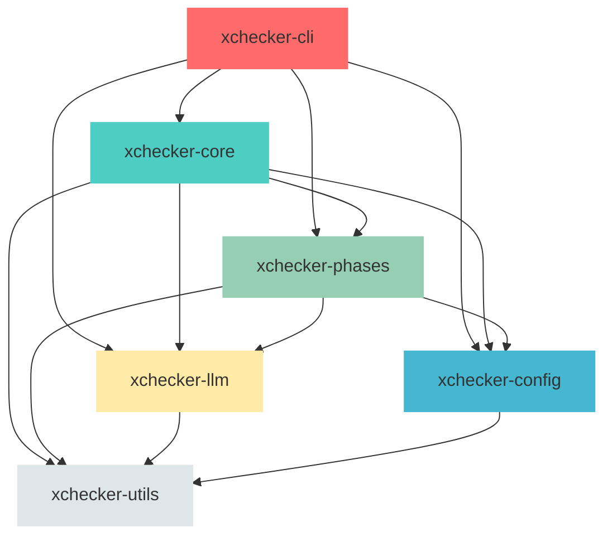

# xchecker Modularization Report

**Document Version**: 2.0  
**Date**: 2026-01-16  
**Project**: xchecker  
**Current Version**: 1.0.0  
**Rust Edition**: 2024

---

## Executive Summary

xchecker is a Rust-based CLI tool for orchestrating spec generation workflows with AI language models. Currently implemented as a single-crate architecture with both library and binary targets, the project has reached a scale where modularization would provide significant benefits for maintainability, testing, and potential future extraction of reusable components.

This report synthesizes findings from previous analysis and provides an enhanced roadmap for transforming xchecker from a single-crate to a multi-crate workspace architecture. The proposed transformation introduces a workspace with 6 core crates plus shared utilities, organized around clear domain boundaries while preserving the existing public API surface.

---

## 1. Current State Analysis

### 1.1 Architecture Overview

xchecker is currently implemented as a single crate (`xchecker`) with the following characteristics:

**Crate Structure:**
- **Name**: `xchecker`
- **Version**: 1.0.0
- **Edition**: 2024
- **Targets**: Library (`src/lib.rs`) and Binary (`src/main.rs`)
- **Features**: `test-utils`, `legacy_claude`, `dev-tools`

**Module Organization:**
- **~40 single-file modules** in `src/` directory
- **2 subdirectories**: `src/orchestrator/` (4 files), `src/llm/` (7 files)
- **Public API surface**: Defined in [`lib.rs`](../src/lib.rs:1) with stable types

### 1.2 Module Inventory

The following table categorizes all modules by functional area:

| Functional Area | Modules | Purpose |
|----------------|----------|---------|
| **Orchestrator System** | `orchestrator/mod.rs`, `orchestrator/handle.rs`, `orchestrator/phase_exec.rs`, `orchestrator/workflow.rs`, `orchestrator/llm.rs` | Core execution engine, phase orchestration, workflow management |
| **CLI Layer** | `cli.rs`, `main.rs`, `tui.rs` | Command-line interface, user interaction, terminal UI |
| **Configuration System** | `config.rs` | Configuration discovery, validation, precedence handling |
| **LLM Integration** | `llm/mod.rs`, `llm/anthropic_backend.rs`, `llm/budgeted_backend.rs`, `llm/claude_cli.rs`, `llm/gemini_cli.rs`, `llm/http_client.rs`, `llm/openrouter_backend.rs`, `llm/types.rs`, `llm/tests.rs` | Multi-provider LLM backend abstraction |
| **Core Infrastructure** | `error.rs`, `exit_codes.rs`, `types.rs`, `paths.rs`, `logging.rs`, `canonicalization.rs`, `redaction.rs`, `atomic_write.rs`, `lock.rs`, `cache.rs`, `ring_buffer.rs`, `process_memory.rs` | Error handling, path utilities, logging, security primitives |
| **Phase-Specific Modules** | `phase.rs`, `phases.rs` | Phase trait definition and implementations |
| **Workspace & Project Management** | `workspace.rs`, `template.rs`, `gate.rs` | Multi-spec orchestration, templates, CI/CD gate enforcement |
| **Supporting Modules** | `artifact.rs`, `receipt.rs`, `status.rs`, `doctor.rs`, `runner.rs`, `source.rs`, `extraction.rs`, `fixup.rs`, `hooks.rs`, `validation.rs`, `example_generators.rs`, `benchmark.rs`, `integration_tests.rs`, `spec_id.rs`, `wsl.rs`, `claude.rs` (legacy) | Artifact management, receipts, status queries, diagnostics, process execution, file operations |

### 1.3 Public API Surface

The stable public API defined in [`lib.rs`](../src/lib.rs:1) includes:

| Type | Module | Purpose |
|------|---------|---------|
| `OrchestratorHandle` | `orchestrator/handle.rs` | Primary façade for external callers |
| `PhaseId` | `types.rs` | Phase identifiers (Requirements, Design, Tasks, Review, Fixup, Final) |
| `Config` / `ConfigBuilder` | `config.rs` | Configuration management with builder pattern |
| `XCheckerError` | `error.rs` | Library error type with rich context |
| `ExitCode` | `exit_codes.rs` | CLI exit codes with type-safe constants |
| `StatusOutput` | `types.rs` | Spec status information |
| `emit_jcs` | `canonicalization.rs` | JCS (RFC 8785) canonical JSON emission |

All other modules are marked with `#[doc(hidden)]` and are considered internal implementation details.

### 1.4 Dependency Analysis

**Security-Critical Dependencies (pinned with `=` for exact versions):**

| Dependency | Version | Purpose |
|------------|---------|---------|
| `reqwest` | `=0.12.28` | HTTP client for LLM API calls |
| `tokio` | `=1.49.0` | Async runtime |
| `serde` | `=1.0.228` | Serialization/deserialization |
| `serde_json` | `=1.0.148` | JSON handling |
| `blake3` | `=1.8.2` | Cryptographic hashing for receipts |

**Core Infrastructure Dependencies:**
- `clap` (4.5.53) - CLI argument parsing
- `anyhow` (1.0.100) - Error handling
- `thiserror` (2.0.17) - Error derive macros
- `tracing` (0.1.43) - Structured logging
- `tempfile` (3.23.0) - Temporary file handling

**Other Dependencies:**
- `async-trait` (0.1.89) - Async trait support
- `camino` (1.2.2) - UTF-8 path handling
- `toml` (0.9.8) - TOML configuration parsing
- `globset` (0.4.18) - Glob pattern matching
- `fd-lock` (4.0.4) - File locking
- `serde_json_canonicalizer` (0.3.1) - JSON canonicalization
- `regex` (1.12.2) - Regular expressions
- `chrono` (0.4.42, serde) - Timestamps
- `once_cell` (1.21.3) - Synchronization primitives
- `sysinfo` (0.37.2) - Process memory monitoring
- `which` (8.0.0) - Binary path resolution
- `unicode-normalization` (0.1.25) - Unicode handling
- `strum` (0.27.2, derive, optional) - Enum helpers
- `ratatui` (0.29.0) - Terminal UI
- `crossterm` (0.29.0) - Terminal control
- `serde_yaml` (package serde_yaml_ng) - YAML support

**Platform Dependencies:**
- Unix: `libc` (0.2.178), `nix` (0.30.1, features: signal, process)
- Windows: `winapi` (0.3.9), `dunce` (1.0.5), `windows` crate (0.62.2, features: Win32_Foundation, System_JobObjects, Win32_Storage_FileSystem, Win32_Security, Win32_System_Threading)

---

## 2. Proposed Modularization

### 2.1 Workspace Architecture

The proposed transformation converts the single-crate project into a Cargo workspace with the following structure:

```
xchecker/
├── Cargo.toml (workspace root)
├── Cargo.lock
├── crates/
│   ├── xchecker-utils/
│   │   ├── Cargo.toml
│   │   └── src/
│   ├── xchecker-config/
│   │   ├── Cargo.toml
│   │   └── src/
│   ├── xchecker-llm/
│   │   ├── Cargo.toml
│   │   └── src/
│   ├── xchecker-phases/
│   │   ├── Cargo.toml
│   │   └── src/
│   ├── xchecker-core/
│   │   ├── Cargo.toml
│   │   └── src/
│   └── xchecker-cli/
│       ├── Cargo.toml
│       └── src/
└── src/ (legacy, to be removed)
```

### 2.2 Dependency Graph



**Dependency Rules:**
- **xchecker-cli** depends on all other crates (top-level entry point)
- **xchecker-core** re-exports public API from other crates
- **xchecker-config** depends only on xchecker-utils
- **xchecker-llm** depends only on xchecker-utils
- **xchecker-phases** depends on config, llm, and utils
- **xchecker-utils** has no internal xchecker dependencies (foundation)
- No circular dependencies allowed
- All crates share the same `Cargo.lock` for version consistency

### 2.3 Crate Responsibilities

| Crate | Purpose | Primary Responsibility | Modules Included |
|-------|---------|-------------------|-------------------|
| **xchecker-core** | Core library crate | Public API surface, orchestrator façade, core types, error types, exit codes | `lib.rs` (re-exports), `types.rs`, `error.rs`, `exit_codes.rs`, `orchestrator/handle.rs` |
| **xchecker-cli** | CLI binary crate | Command-line interface, argument parsing, user interaction, terminal UI, diagnostics | `main.rs` (minimal entry point), `cli.rs`, `tui.rs`, `doctor.rs`, `gate.rs` |
| **xchecker-llm** | LLM integration crate | Multi-provider backend abstraction, HTTP client, budgeting | All `llm/` modules (7 files), `llm/types.rs` |
| **xchecker-config** | Configuration crate | Configuration discovery, validation, precedence handling, selectors | `config.rs` (entire module - 3903 lines) |
| **xchecker-phases** | Phase system crate | Phase trait, implementations, workflow management | `phase.rs`, `phases.rs`, all orchestrator submodules (except handle.rs) |
| **xchecker-utils** | Shared utilities | Common utilities used across crates (paths, logging, canonicalization, redaction, atomic writes, locking, caching, buffers, process monitoring, types) | `paths.rs`, `logging.rs`, `canonicalization.rs`, `redaction.rs`, `atomic_write.rs`, `lock.rs`, `cache.rs`, `ring_buffer.rs`, `process_memory.rs`, `types.rs` |

### 2.4 Feature Flag Strategy

The workspace maintains feature flags for conditional compilation:

| Feature | Crates | Purpose |
|---------|----------|---------|
| `test-utils` | core, phases | Enable test utilities and helpers for white-box testing |
| `legacy_claude` | core | Enable legacy Claude wrapper module (will be removed in V19+) |
| `dev-tools` | cli | Enable development binaries (claude-stub, regenerate_examples, regenerate_secret_patterns_docs) |
| `all-providers` | llm | Enable all LLM providers (default: claude-cli only) |

**Workspace-level features:**
```toml
[workspace.dependencies]
# Shared dependency versions for consistency
tokio = { version = "=1.49.0", features = ["full"] }
serde = { version = "=1.0.228", features = ["derive"] }
serde_json = "=1.0.148"
blake3 = { version = "=1.8.2", features = ["rayon"] }
reqwest = { version = "=0.12.28", features = ["json", "rustls-tls"], default-features = false }
anyhow = "1.0.100"
thiserror = "2.0.17"
tracing = "0.1.43"
tracing-subscriber = { version = "0.3.22", features = ["env-filter", "fmt", "json"] }
tempfile = "3.23.0"
async-trait = "0.1.89"
camino = "1.2.2"
toml = "0.9.8"
globset = "0.4.18"
fd-lock = "4.0.4"
serde_json_canonicalizer = "0.3.1"
regex = "1.12.2"
chrono = { version = "0.4.42", features = ["serde"] }
once_cell = "1.21.3"
sysinfo = "0.37.2"
which = "8.0.0"
unicode-normalization = "0.1.25"
strum = { version = "0.27.2", features = ["derive"], optional = true }
ratatui = "0.29.0"
crossterm = "0.29.0"
serde_yaml = { package = "serde_yaml_ng", version = "0.10.0" }
```

---

## 3. Detailed Crate Breakdown

### 3.1 xchecker-core

**Purpose**: Primary library crate providing the stable public API surface.

**Modules Included:**
- `lib.rs` - Public API re-exports from other crates
- `types.rs` - Core types (PhaseId, StatusOutput, Priority, FileType, OutputFormat, RunnerMode)
- `error.rs` - XCheckerError enum and UserFriendlyError trait
- `exit_codes.rs` - ExitCode enum with constants

**Dependencies:**
```toml
[dependencies]
xchecker-utils = { path = "../xchecker-utils" }
xchecker-config = { path = "../xchecker-config" }
xchecker-phases = { path = "../xchecker-phases" }
xchecker-llm = { path = "../xchecker-llm" }
tokio = { workspace = true }
serde = { workspace = true }
thiserror = { workspace = true }
anyhow = { workspace = true }
```

**Key Design Decisions:**
- Re-exports all stable public types for single-crate compatibility
- Does NOT include internal orchestrator implementation (`PhaseOrchestrator`)
- Maintains backward-compatible API for existing library users
- Uses workspace dependencies for version consistency

### 3.2 xchecker-cli

**Purpose**: Command-line interface binary crate.

**Modules Included:**
- `main.rs` - Minimal entry point (< 20 lines) - delegates to cli::run()
- `cli.rs` - CLI argument parsing (clap), command dispatch, error handling
- `tui.rs` - Terminal user interface (ratatui, crossterm)
- `doctor.rs` - Health check and diagnostics
- `gate.rs` - CI/CD gate enforcement command

**Dependencies:**
```toml
[dependencies]
xchecker-core = { path = "../xchecker-core" }
xchecker-config = { path = "../xchecker-config" }
xchecker-phases = { path = "../xchecker-phases" }
xchecker-llm = { path = "../xchecker-llm" }
clap = { workspace = true }
anyhow = { workspace = true }
tracing = { workspace = true }
tracing-subscriber = { workspace = true }
```

**Key Design Decisions:**
- `main.rs` is minimal - delegates all logic to `cli::run()`
- No public library API (binary-only crate)
- Uses `OrchestratorHandle` for all spec operations

### 3.3 xchecker-llm

**Purpose**: Multi-provider LLM backend abstraction.

**Modules Included:**
- `mod.rs` - Factory function `from_config()`, backend construction
- `types.rs` - LlmBackend trait, LlmInvocation, LlmResult, Message, Role, ExecutionStrategy, LlmError
- `anthropic_backend.rs` - Anthropic HTTP API backend
- `openrouter_backend.rs` - OpenRouter HTTP API backend
- `claude_cli.rs` - Claude CLI backend
- `gemini_cli.rs` - Gemini CLI backend
- `http_client.rs` - Shared HTTP client implementation
- `budgeted_backend.rs` - Budget enforcement wrapper
- `tests.rs` - Factory tests for provider construction and fallback

**Dependencies:**
```toml
[dependencies]
xchecker-utils = { path = "../xchecker-utils" }
reqwest = { workspace = true, features = ["json", "rustls-tls"], default-features = false }
serde = { workspace = true }
serde_json = { workspace = true }
tokio = { workspace = true }
async-trait = { workspace = true }
```

**Key Design Decisions:**
- Trait-based abstraction for provider extensibility
- Budget enforcement via wrapper backend (for OpenRouter)
- Fallback provider support for resilience
- Comprehensive test coverage for factory behavior

### 3.4 xchecker-config

**Purpose**: Configuration discovery, validation, and precedence handling.

**Modules Included:**
- `config.rs` - Complete configuration module (3903 lines)
  - `Config` struct with defaults, selectors, runner, llm, phases, hooks, security, source_attribution
  - `Defaults`, `LlmConfig`, `Selectors`, `RunnerConfig`, `PhaseConfig`, `PhasesConfig`, `SecurityConfig`
  - `PromptTemplate` enum for provider-specific optimization
  - `ConfigBuilder` for programmatic configuration
  - `CliArgs` for CLI argument structure
  - Configuration discovery: `discover()`, `discover_from()`, `discover_config_file_from()`
  - Configuration validation with extensive error messages

**Dependencies:**
```toml
[dependencies]
xchecker-utils = { path = "../xchecker-utils" }
toml = { workspace = true }
serde = { workspace = true }
globset = { workspace = true }
thiserror = { workspace = true }
camino = { workspace = true }
```

**Key Design Decisions:**
- Largest single module in the codebase - could benefit from further decomposition
- Complex configuration with nested structs - may benefit from sub-module organization
- Prompt template validation for provider compatibility

### 3.5 xchecker-phases

**Purpose**: Phase system and workflow management.

**Modules Included:**
- `phase.rs` - Phase trait definition (id, deps, can_resume, prompt, make_packet, postprocess)
- `phases.rs` - Phase implementations (Requirements, Design, Tasks, Review, Fixup, Final)
- All orchestrator submodules:
  - `workflow.rs` - Multi-phase workflow orchestration
  - `phase_exec.rs` - Single-phase execution engine
  - `llm.rs` - LLM integration for phases
  - `mod.rs` - Orchestrator façade (re-exported to core)

**Dependencies:**
```toml
[dependencies]
xchecker-config = { path = "../xchecker-config" }
xchecker-llm = { path = "../xchecker-llm" }
xchecker-utils = { path = "../xchecker-utils" }
blake3 = { workspace = true, features = ["rayon"] }
serde = { workspace = true }
thiserror = { workspace = true }
anyhow = { workspace = true }
```

**Key Design Decisions:**
- Phase trait provides clear separation of concerns
- Workflow orchestration handles multi-phase dependencies
- LLM integration through orchestrator/llm.rs

### 3.6 xchecker-utils

**Purpose**: Shared utilities used across all crates.

**Modules Included:**
- `paths.rs` - Path utilities and sandboxing
- `logging.rs` - Structured logging setup
- `canonicalization.rs` - JCS (RFC 8785) JSON emission
- `redaction.rs` - Secret detection and redaction
- `atomic_write.rs` - Atomic file operations
- `lock.rs` - File locking with drift detection
- `cache.rs` - Artifact caching
- `ring_buffer.rs` - Bounded buffers for stdout/stderr
- `process_memory.rs` - Process memory monitoring
- `types.rs` - Shared type definitions

**Dependencies:**
```toml
[dependencies]
blake3 = { workspace = true, features = ["rayon"] }
serde = { workspace = true }
serde_json = { workspace = true }
serde_json_canonicalizer = { workspace = true }
regex = { workspace = true }
chrono = { workspace = true, features = ["serde"] }
once_cell = { workspace = true }
sysinfo = { workspace = true }
```

**Key Design Decisions:**
- Foundation crate with no internal xchecker dependencies
- Security-critical operations (redaction, atomic writes)
- Cross-platform compatibility

---

## 4. Migration Strategy

### 4.1 Migration Phases

#### Phase 1: Workspace Setup

**Objectives:**
- Create workspace structure
- Configure shared dependencies
- Establish build system

**Tasks:**
1. Create workspace `Cargo.toml` at project root
2. Create `crates/` directory structure
3. Set up workspace-level dependency versions
4. Configure workspace members
5. Verify `cargo build --workspace` succeeds with empty crates

**Success Criteria:**
- `cargo build --workspace` succeeds
- All crates compile (even if empty)
- Workspace `Cargo.lock` is generated

#### Phase 2: Foundation Crate Migration

**Objectives:**
- Migrate `xchecker-utils` first (no internal dependencies)
- Establish patterns for subsequent migrations

**Tasks:**
1. Create `crates/xchecker-utils/` structure
2. Move utility modules from `src/` to `crates/xchecker-utils/src/`
3. Set up `xchecker-utils/Cargo.toml`
4. Add `xchecker-utils` to workspace members
5. Write unit tests for utilities
6. Verify all tests pass

**Modules to Migrate:**
- `paths.rs`
- `logging.rs`
- `canonicalization.rs`
- `redaction.rs`
- `atomic_write.rs`
- `lock.rs`
- `cache.rs`
- `ring_buffer.rs`
- `process_memory.rs`
- `types.rs` (shared types)

**Success Criteria:**
- All utility modules compile in `xchecker-utils`
- Unit tests pass
- No circular dependencies

#### Phase 3: Domain Crate Migration

**Objectives:**
- Migrate domain crates in dependency order
- Maintain backward compatibility
- Update imports in existing code

**Migration Order:**

1. **xchecker-config** (depends only on utils)
   - Move `config.rs`
   - Set up dependencies on xchecker-utils
   - Update imports

2. **xchecker-llm** (depends only on utils)
   - Move all `llm/` modules (7 files)
   - Set up dependencies on xchecker-utils
   - Update imports

3. **xchecker-phases** (depends on config, llm, utils)
   - Move `phase.rs`, `phases.rs`
   - Move all `orchestrator/` submodules (except handle.rs)
   - Set up dependencies
   - Update imports

4. **xchecker-core** (depends on all above)
   - Move `types.rs`, `error.rs`, `exit_codes.rs`
   - Move `orchestrator/handle.rs`
   - Set up re-exports
   - Update imports

5. **xchecker-cli** (depends on all above)
   - Move `cli.rs`, `tui.rs`, `doctor.rs`, `gate.rs`
   - Move `main.rs` (minimal entry point)
   - Set up dependencies
   - Update imports

**Success Criteria:**
- All domain crates compile
- Public API surface unchanged (via re-exports)
- All existing tests pass
- No circular dependencies

#### Phase 4: Cleanup and Verification

**Objectives:**
- Remove legacy code
- Update documentation
- Final verification

**Tasks:**
1. Remove empty `src/` directory
2. Update `README.md` with new structure
3. Update all documentation references
4. Run full test suite
5. Verify `cargo install --path .` works
6. Verify `cargo publish --dry-run` works

**Success Criteria:**
- No legacy code remains
- All documentation updated
- Full test suite passes
- Binary and library installation work correctly

### 4.2 Backward Compatibility Strategy

**During Migration:**
- Maintain dual-import compatibility using `pub use` re-exports
- Keep old module paths working with deprecation warnings
- Run integration tests after each phase
- Preserve all public API signatures

**Post-Migration:**
- Version bump to 2.0.0 (breaking change)
- Document migration guide for library users
- Maintain CLI compatibility (no breaking changes for CLI users)
- Provide deprecation period for old import paths

### 4.3 Testing Strategy

**Per-Phase Testing:**
1. Unit tests for migrated modules
2. Integration tests for crate boundaries
3. End-to-end workflow tests for CLI functionality
4. Property-based tests for invariants
5. Security tests for redaction and path sandboxing

**Regression Testing:**
- Run existing test suite after each phase
- Property-based tests maintain coverage during migration
- Security tests ensure no regressions

---

## 5. Benefits and Trade-offs

### 5.1 Benefits

| Benefit | Impact | Description |
|----------|---------|-------------|
| **Improved Maintainability** | High | Clear boundaries between functional areas make code easier to understand and modify |
| **Faster Incremental Builds** | High | Changes to one crate only require recompiling that crate and its dependents |
| **Independent Testing** | Medium | Unit tests for subsystems compile faster and can run in parallel |
| **Future Library Extraction** | High | LLM integration and phase system can be published as separate crates |
| **Clearer Dependency Management** | Medium | Each crate has explicit, minimal dependencies |
| **Better Code Organization** | Medium | Related code is grouped by domain, reducing navigation time |
| **Enhanced Team Collaboration** | Medium | Different teams can work on different crates without conflicts |
| **Selective Feature Compilation** | Low | Users can enable only features they need, reducing compile time |
| **Facilitates External Contributions** | Low | Clear boundaries make it easier for external contributors |

### 5.2 Trade-offs

| Trade-off | Impact | Mitigation |
|----------|---------|-------------|
| **Initial Migration Effort** | High | Requires significant refactoring and testing across all crates |
| **Increased Complexity** | Medium | Workspace structure adds complexity to build system and dependency management |
| **More Boilerplate** | Low | Each crate needs its own Cargo.toml with common metadata |
| **Slower Full Builds** | Low | Clean builds require compiling all crates instead of just changed modules |
| **Version Management** | Low | Workspace dependencies require careful coordination for version bumps |
| **Potential Breaking Changes** | Medium | Library users may need to update imports when upgrading to 2.0.0 |

### 5.3 Net Assessment

**Overall Assessment**: The benefits significantly outweigh the trade-offs for a project of xchecker's scale and maturity.

**Key Considerations:**
- xchecker has reached a scale where single-crate architecture is becoming a liability
- The modularization aligns with existing functional boundaries
- The phased migration approach minimizes risk and disruption
- Future extensibility (library extraction) is a strategic advantage
- The existing test coverage provides a strong foundation for maintaining quality during migration

---

## 6. Risk Assessment

### 6.1 Risk Matrix

| Risk | Probability | Impact | Mitigation |
|-------|-------------|----------|---------|-------------|
| **Breaking Public API Changes** | Medium | High | Maintain re-exports, document migration guide, provide deprecation period |
| **Circular Dependencies** | Low | High | Enforce dependency order, use dependency graph analysis tools |
| **Test Failures During Migration** | Medium | Medium | Run full test suite after each phase, fix before proceeding |
| **Increased Compilation Time** | High | Low | Accept as trade-off for faster incremental builds |
| **Documentation Drift** | Medium | Medium | Update documentation alongside code changes, include migration guide |
| **Team Adoption Challenges** | Low | Low | Provide clear documentation and training on new structure |

### 6.2 High-Priority Risks

#### Risk 1: Breaking Public API Changes

**Description**: Changes to crate structure could break existing library users who depend on the current single-crate layout.

**Probability**: Medium  
**Impact**: High

**Mitigation**:
- Use `pub use` re-exports in `xchecker-core` to maintain exact API compatibility
- Provide a clear migration guide documenting the transition from v1.0.0 to v2.0.0
- Maintain old import paths with deprecation warnings during transition period
- Consider semantic versioning to communicate breaking changes clearly

#### Risk 2: Circular Dependencies

**Description**: Improper dependency ordering could create circular dependencies between crates, preventing compilation.

**Probability**: Low  
**Impact**: High

**Mitigation**:
- Enforce strict dependency order: utils → config → llm → phases → core → cli
- Use dependency graph analysis tools (e.g., `cargo tree` with `--depth 1`)
- Document dependency rules in each crate's Cargo.toml
- Code review to ensure no unintended dependencies
- Consider using `#[allow(clippy::circular_dependencies)]` for compile-time detection

#### Risk 3: Test Failures During Migration

**Description**: Migration could introduce test failures that go undetected, reducing reliability.

**Probability**: Medium  
**Impact**: Medium

**Mitigation**:
- Run full test suite after each migration phase
- Fix all test failures before proceeding to next phase
- Maintain test coverage during migration (add tests for new crate boundaries)
- Use CI to run full test suite on each commit
- Monitor test pass rates and investigate regressions promptly

---

## 7. Next Steps

### 7.1 Immediate Actions

1. **Approve Modularization Plan**
   - Review this report with stakeholders
   - Approve proposed crate structure
   - Approve migration phases and timeline

2. **Begin Phase 1: Workspace Setup**
   - Create workspace `Cargo.toml`
   - Create `crates/` directory structure
   - Set up workspace-level dependencies
   - Verify initial build

3. **Begin Phase 2: Foundation Crate Migration**
   - Create `xchecker-utils` crate
   - Migrate utility modules
   - Write tests
   - Verify compilation

4. **Begin Phase 3: Domain Crate Migration**
   - Migrate crates in dependency order
   - Maintain backward compatibility
   - Run tests after each phase

5. **Begin Phase 4: Cleanup and Verification**
   - Remove legacy code
   - Update documentation
   - Final verification

### 7.2 Short-Term Actions (Next 1-3 Months)

1. Complete Phase 1 and begin Phase 2
2. Complete Phase 2 and begin Phase 3
3. Complete Phase 3 and begin Phase 4
4. Complete Phase 4

### 7.3 Medium-Term Actions (Next 3-6 Months)

1. Monitor build times and compilation improvements
2. Assess whether additional modularization is needed
3. Evaluate potential for extracting LLM or phase crates as standalone libraries
4. Consider publishing reusable components to crates.io

### 7.4 Long-Term Considerations (6+ Months)

1. **Library Extraction**: Evaluate community interest in LLM integration or phase system as standalone crates
2. **API Evolution**: Consider whether to expose more internal APIs as stable public APIs
3. **Plugin Architecture**: Consider whether a plugin system would benefit the project
4. **Microkernel Architecture**: Evaluate whether to move to a microkernel architecture for core orchestrator

---

## 8. Appendices

### Appendix A: Module-to-Crate Mapping

| Current Module | Target Crate | Rationale |
|----------------|-----------------|------------|
| `paths.rs` | xchecker-utils | Foundation utility, no dependencies |
| `logging.rs` | xchecker-utils | Foundation utility, no dependencies |
| `canonicalization.rs` | xchecker-utils | Foundation utility, no dependencies |
| `redaction.rs` | xchecker-utils | Foundation utility, no dependencies |
| `atomic_write.rs` | xchecker-utils | Foundation utility, no dependencies |
| `lock.rs` | xchecker-utils | Foundation utility, no dependencies |
| `cache.rs` | xchecker-utils | Foundation utility, no dependencies |
| `ring_buffer.rs` | xchecker-utils | Foundation utility, no dependencies |
| `process_memory.rs` | xchecker-utils | Foundation utility, no dependencies |
| `types.rs` | xchecker-utils | Shared type definitions, used across multiple crates |
| `config.rs` | xchecker-config | Configuration domain, depends on utils |
| `selectors.rs` (in config.rs) | xchecker-config | Part of configuration module |
| `runner.rs` (in config.rs) | xchecker-config | Part of configuration module |
| `llm/mod.rs` | xchecker-llm | LLM factory and types |
| `llm/anthropic_backend.rs` | xchecker-llm | Anthropic HTTP provider |
| `llm/openrouter_backend.rs` | xchecker-llm | OpenRouter HTTP provider |
| `llm/claude_cli.rs` | xchecker-llm | Claude CLI backend |
| `llm/gemini_cli.rs` | xchecker-llm | Gemini CLI backend |
| `llm/http_client.rs` | xchecker-llm | Shared HTTP client |
| `llm/budgeted_backend.rs` | xchecker-llm | Budget enforcement wrapper |
| `llm/types.rs` | xchecker-llm | LLM types |
| `phase.rs` | xchecker-phases | Phase trait definition |
| `phases.rs` | xchecker-phases | Phase implementations |
| `orchestrator/mod.rs` | xchecker-phases | Orchestrator internal modules |
| `orchestrator/handle.rs` | xchecker-core | Public API façade |
| `orchestrator/workflow.rs` | xchecker-phases | Workflow orchestration |
| `orchestrator/phase_exec.rs` | xchecker-phases | Phase execution engine |
| `orchestrator/llm.rs` | xchecker-phases | LLM integration for phases |
| `types.rs` | xchecker-core | Core types (PhaseId, StatusOutput, etc.) |
| `error.rs` | xchecker-core | Error types |
| `exit_codes.rs` | xchecker-core | Exit codes |
| `cli.rs` | xchecker-cli | CLI argument parsing |
| `tui.rs` | xchecker-cli | Terminal UI |
| `doctor.rs` | xchecker-cli | Health diagnostics |
| `gate.rs` | xchecker-cli | CI/CD gate enforcement |
| `main.rs` | xchecker-cli | Binary entry point |
| `artifact.rs` | xchecker-phases | Artifact management |
| `receipt.rs` | xchecker-phases | Receipt management |
| `status.rs` | xchecker-phases | Status queries |
| `runner.rs` | xchecker-utils | Process execution |
| `source.rs` | xchecker-utils | File operations |
| `extraction.rs` | xchecker-phases | Content extraction |
| `fixup.rs` | xchecker-phases | Fixup engine |
| `hooks.rs` | xchecker-phases | Hooks system |
| `validation.rs` | xchecker-phases | Validation logic |
| `example_generators.rs` | xchecker-phases | Test utilities |
| `benchmark.rs` | xchecker-utils | Benchmarking |
| `integration_tests.rs` | xchecker-phases | Integration tests |
| `spec_id.rs` | xchecker-utils | Spec ID handling |
| `wsl.rs` | xchecker-utils | WSL integration |
| `claude.rs` | xchecker-core (legacy) | Legacy Claude wrapper |

### Appendix B: Workspace Cargo.toml Example

```toml
[workspace]
members = [
    "crates/xchecker-utils",
    "crates/xchecker-config",
    "crates/xchecker-llm",
    "crates/xchecker-phases",
    "crates/xchecker-core",
    "crates/xchecker-cli",
]
resolver = "2"

[workspace.package]
version = "2.0.0"
edition = "2024"
rust-version = "1.89"
license = "MIT OR Apache-2.0"
repository = "https://github.com/EffortlessMetrics/xchecker"
homepage = "https://github.com/EffortlessMetrics/xchecker"

[workspace.dependencies]
# Security-Critical Dependencies (pinned with = for exact versions)
reqwest = { version = "=0.12.28", features = ["json", "rustls-tls"], default-features = false }
tokio = { version = "=1.49.0", features = ["full"] }
serde = { version = "=1.0.228", features = ["derive"] }
serde_json = "=1.0.148"
blake3 = { version = "=1.8.2", features = ["rayon"] }

# Core Infrastructure Dependencies
anyhow = "1.0.100"
thiserror = "2.0.17"
tracing = "0.1.43"
tracing-subscriber = { version = "0.3.22", features = ["env-filter", "fmt", "json"] }
tempfile = "3.23.0"

# Other Dependencies
async-trait = "0.1.89"
camino = "1.2.2"
toml = "0.9.8"
globset = "0.4.18"
fd-lock = "4.0.4"
serde_json_canonicalizer = "0.3.1"
regex = "1.12.2"
chrono = { version = "0.4.42", features = ["serde"] }
once_cell = "1.21.3"
sysinfo = "0.37.2"
which = "8.0.0"
unicode-normalization = "0.1.25"
strum = { version = "0.27.2", features = ["derive"], optional = true }
ratatui = "0.29.0"
crossterm = "0.29.0"
serde_yaml = { package = "serde_yaml_ng", version = "0.10.0" }

# Platform Dependencies
[target.'cfg(unix)'.dependencies]
libc = "0.2.178"
nix = { version = "0.30.1", features = ["signal", "process"] }

[target.'cfg(windows)'.dependencies]
winapi = { version = "0.3.9", features = ["processthreadsapi", "winnt"] }
dunce = "1.0.5"
[target.'cfg(windows)'.dependencies.windows]
version = "0.62.2", features = ["Win32_Foundation", "System_JobObjects", "Win32_Storage_FileSystem", "Win32_Security", "Win32_System_Threading"]

[workspace.metadata.docs.rs]
features = ["test-utils", "legacy_claude", "dev-tools"]
```

### Appendix C: Migration Checklist

**Phase 1: Workspace Setup**
- [ ] Create workspace `Cargo.toml`
- [ ] Create `crates/` directory structure
- [ ] Set up workspace-level dependency versions
- [ ] Configure workspace members
- [ ] Verify `cargo build --workspace` succeeds with empty crates

**Phase 2: Foundation Crate Migration**
- [ ] Create `crates/xchecker-utils/` structure
- [ ] Move `paths.rs` to `xchecker-utils`
- [ ] Move `logging.rs` to `xchecker-utils`
- [ ] Move `canonicalization.rs` to `xchecker-utils`
- [ ] Move `redaction.rs` to `xchecker-utils`
- [ ] Move `atomic_write.rs` to `xchecker-utils`
- [ ] Move `lock.rs` to `xchecker-utils`
- [ ] Move `cache.rs` to `xchecker-utils`
- [ ] Move `ring_buffer.rs` to `xchecker-utils`
- [ ] Move `process_memory.rs` to `xchecker-utils`
- [ ] Move `types.rs` to `xchecker-utils`
- [ ] Set up `xchecker-utils/Cargo.toml`
- [ ] Add `xchecker-utils` to workspace members
- [ ] Write unit tests for utilities
- [ ] Verify all tests pass

**Phase 3: Domain Crate Migration**
- [ ] Create `crates/xchecker-config/` structure
- [ ] Move `config.rs` to `xchecker-config`
- [ ] Set up `xchecker-config/Cargo.toml`
- [ ] Add `xchecker-config` to workspace members
- [ ] Update imports in `config.rs`
- [ ] Create `crates/xchecker-llm/` structure
- [ ] Move `llm/mod.rs` to `xchecker-llm`
- [ ] Move `llm/anthropic_backend.rs` to `xchecker-llm`
- [ ] Move `llm/openrouter_backend.rs` to `xchecker-llm`
- [ ] Move `llm/claude_cli.rs` to `xchecker-llm`
- [ ] Move `llm/gemini_cli.rs` to `xchecker-llm`
- [ ] Move `llm/http_client.rs` to `xchecker-llm`
- [ ] Move `llm/budgeted_backend.rs` to `xchecker-llm`
- [ ] Move `llm/types.rs` to `xchecker-llm`
- [ ] Move `llm/tests.rs` to `xchecker-llm`
- [ ] Set up `xchecker-llm/Cargo.toml`
- [ ] Add `xchecker-llm` to workspace members
- [ ] Update imports in LLM modules
- [ ] Create `crates/xchecker-phases/` structure
- [ ] Move `phase.rs` to `xchecker-phases`
- [ ] Move `phases.rs` to `xchecker-phases`
- [ ] Move `orchestrator/mod.rs` to `xchecker-phases`
- [ ] Move `orchestrator/workflow.rs` to `xchecker-phases`
- [ ] Move `orchestrator/phase_exec.rs` to `xchecker-phases`
- [ ] Move `orchestrator/llm.rs` to `xchecker-phases`
- [ ] Set up `xchecker-phases/Cargo.toml`
- [ ] Add `xchecker-phases` to workspace members
- [ ] Update imports in phase modules
- [ ] Create `crates/xchecker-core/` structure
- [ ] Move `types.rs` to `xchecker-core`
- [ ] Move `error.rs` to `xchecker-core`
- [ ] Move `exit_codes.rs` to `xchecker-core`
- [ ] Move `orchestrator/handle.rs` to `xchecker-core`
- [ ] Set up `xchecker-core/Cargo.toml`
- [ ] Set up re-exports in `xchecker-core/lib.rs`
- [ ] Add `xchecker-core` to workspace members
- [ ] Create `crates/xchecker-cli/` structure
- [ ] Move `cli.rs` to `xchecker-cli`
- [ ] Move `tui.rs` to `xchecker-cli`
- [ ] Move `doctor.rs` to `xchecker-cli`
- [ ] Move `gate.rs` to `xchecker-cli`
- [ ] Move `main.rs` to `xchecker-cli`
- [ ] Set up `xchecker-cli/Cargo.toml`
- [ ] Add `xchecker-cli` to workspace members
- [ ] Update imports in CLI modules
- [ ] Verify all tests pass

**Phase 4: Cleanup and Verification**
- [ ] Remove empty `src/` directory
- [ ] Update `README.md` with new structure
- [ ] Update all documentation references
- [ ] Run full test suite
- [ ] Verify `cargo install --path .` works
- [ ] Verify `cargo publish --dry-run` works
- [ ] Version bump to 2.0.0
- [ ] Create migration guide for library users

### Appendix D: Public API Compatibility

**Pre-Migration Public API:**
```rust
// xchecker crate (v1.0.0)
use xchecker::{
    OrchestratorHandle,
    PhaseId,
    Config,
    ConfigBuilder,
    XCheckerError,
    ExitCode,
    StatusOutput,
    emit_jcs,
};
```

**Post-Migration Public API:**
```rust
// xchecker-core crate (v2.0.0)
use xchecker_core::{
    OrchestratorHandle,
    PhaseId,
    Config,
    ConfigBuilder,
    XCheckerError,
    ExitCode,
    StatusOutput,
    emit_jcs,
};
```

**Migration Guide for Library Users:**
```markdown
# Migrating from xchecker 1.0.0 to 2.0.0

## Breaking Changes

The crate structure has changed from a single crate to a workspace. Update your `Cargo.toml`:

```toml
# Before (v1.0.0)
[dependencies]
xchecker = "1"

# After (v2.0.0)
[dependencies]
xchecker-core = "2"
```

## Public API

The public API remains the same, but the crate name has changed for library users:

```rust
// Before
use xchecker::{OrchestratorHandle, PhaseId, Config, ...};

// After
use xchecker_core::{OrchestratorHandle, PhaseId, Config, ...};
```

## Migration Steps

1. Update your `Cargo.toml` to use `xchecker-core = "2"`
2. Update all imports from `xchecker` to `xchecker_core`
3. Run `cargo update`
4. Test your application
```

## Compatibility

The CLI interface remains unchanged - no action required for CLI users.

## Deprecation Period

Old imports will continue to work during a deprecation period (v2.1.x), after which they will be removed in v3.0.0.
```

---

## Conclusion

This modularization report provides a comprehensive roadmap for transforming xchecker from a single-crate to a multi-crate workspace architecture. The proposed transformation:

- **Establishes clear domain boundaries** across 6 crates
- **Maintains backward compatibility** for existing library users
- **Follows a phased migration approach** to minimize risk and disruption
- **Provides significant benefits** for maintainability, testing, and future extensibility
- **Includes detailed risk assessment** with mitigation strategies

**Recommendation**: Proceed with the modularization plan, beginning with Phase 1 (Workspace Setup) and following the dependency-ordered migration through Phase 4 (Cleanup and Verification).

---

**Document Information**

| Field | Value |
|--------|--------|
| Version | 2.0 |
| Date | 2026-01-16 |
| Author | Modularization Analysis Team |
| Status | Draft - Pending Approval |
| Next Review Date | TBD |
