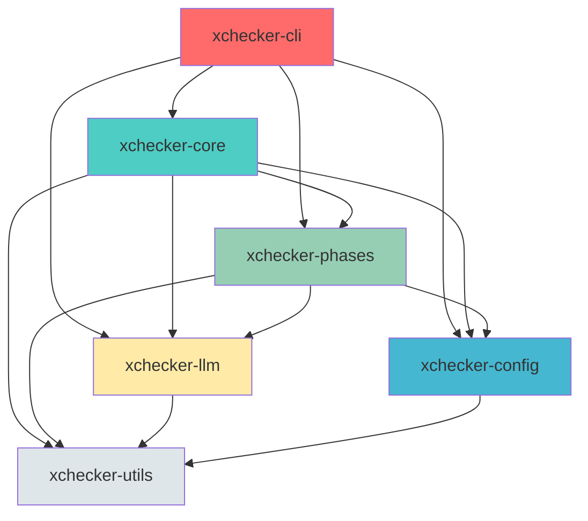

# xchecker Modularization Report

**Document Version**: 1.0  
**Date**: 2025-01-15  
**Project**: xchecker  
**Current Version**: 1.0.0  
**Rust Edition**: 2024  

---

## Executive Summary

xchecker is a Rust-based CLI tool for orchestrating spec generation workflows with AI language models. Currently implemented as a single-crate architecture with both library and binary targets, the project has reached a scale where modularization would provide significant benefits for maintainability, testing, and potential future extraction of reusable components.

This report synthesizes findings from previous analysis and design tasks to provide a comprehensive roadmap for transforming xchecker from a single-crate to a multi-crate workspace architecture. The proposed modularization aims to:

- **Improve maintainability** by establishing clear boundaries between functional areas
- **Enable independent testing** of subsystems with reduced compilation times
- **Facilitate future library extraction** of reusable components (LLM integration, phase system)
- **Support incremental adoption** through a phased migration approach
- **Maintain backward compatibility** for existing CLI and library users

The proposed transformation introduces a workspace with 5 core crates plus shared utilities, organized around clear domain boundaries while preserving the existing public API surface.

---

## 1. Current State Analysis

### 1.1 Architecture Overview

xchecker is currently implemented as a single crate (`xchecker`) with the following characteristics:

**Crate Structure:**
- **Name**: `xchecker`
- **Version**: 1.0.0
- **Edition**: 2024
- **Targets**: Library (`src/lib.rs`) and Binary (`src/main.rs`)
- **Features**: `test-utils`, `legacy_claude`, `dev-tools`

**Module Organization:**
- **~40 single-file modules** in `src/` directory
- **2 subdirectories**: `src/orchestrator/` (4 files), `src/llm/` (7 files)
- **Public API surface**: Defined in [`lib.rs`](../src/lib.rs:1) with stable types

### 1.2 Module Inventory

The following table categorizes all modules by functional area:

| Functional Area | Modules | Purpose |
|----------------|----------|---------|
| **Orchestrator System** | `orchestrator/mod.rs`, `orchestrator/handle.rs`, `orchestrator/phase_exec.rs`, `orchestrator/workflow.rs`, `orchestrator/llm.rs` | Core execution engine, phase orchestration, workflow management |
| **CLI Layer** | `cli.rs`, `main.rs`, `tui.rs` | Command-line interface, user interaction, terminal UI |
| **Configuration System** | `config.rs` | Configuration discovery, validation, precedence handling |
| **LLM Integration** | `llm/mod.rs`, `llm/anthropic_backend.rs`, `llm/budgeted_backend.rs`, `llm/claude_cli.rs`, `llm/gemini_cli.rs`, `llm/http_client.rs`, `llm/openrouter_backend.rs`, `llm/types.rs`, `llm/tests.rs` | Multi-provider LLM backend abstraction |
| **Core Infrastructure** | `error.rs`, `exit_codes.rs`, `types.rs`, `paths.rs`, `logging.rs`, `canonicalization.rs`, `redaction.rs`, `atomic_write.rs`, `lock.rs`, `cache.rs`, `ring_buffer.rs`, `process_memory.rs` | Error handling, path utilities, logging, security primitives |
| **Phase-Specific Modules** | `phase.rs`, `phases.rs` | Phase trait definition and implementations |
| **Workspace & Project Management** | `workspace.rs`, `template.rs`, `gate.rs` | Multi-spec orchestration, templates, CI/CD gate enforcement |
| **Supporting Modules** | `artifact.rs`, `receipt.rs`, `status.rs`, `doctor.rs`, `runner.rs`, `source.rs`, `extraction.rs`, `fixup.rs`, `hooks.rs`, `validation.rs`, `example_generators.rs`, `benchmark.rs`, `integration_tests.rs`, `spec_id.rs`, `wsl.rs`, `claude.rs` (legacy) | Artifact management, receipts, status queries, diagnostics, process execution, file operations |

### 1.3 Public API Surface

The stable public API defined in [`lib.rs`](../src/lib.rs:1) includes:

| Type | Module | Purpose |
|------|---------|---------|
| `OrchestratorHandle` | `orchestrator/handle.rs` | Primary façade for external callers |
| `PhaseId` | `types.rs` | Phase identifiers (Requirements, Design, Tasks, Review, Fixup, Final) |
| `Config` / `ConfigBuilder` | `config.rs` | Configuration management with builder pattern |
| `XCheckerError` | `error.rs` | Library error type with rich context |
| `ExitCode` | `exit_codes.rs` | CLI exit codes with type-safe constants |
| `StatusOutput` | `types.rs` | Spec status information |
| `emit_jcs` | `canonicalization.rs` | JCS (RFC 8785) canonical JSON emission |

All other modules are marked with `#[doc(hidden)]` and are considered internal implementation details.

### 1.4 Dependency Analysis

**Security-Critical Dependencies (pinned with `=`):**

| Dependency | Version | Purpose |
|------------|----------|---------|
| `reqwest` | `=0.12.28` | HTTP client for LLM API calls |
| `tokio` | `=1.49.0` | Async runtime |
| `serde` | `=1.0.228` | Serialization/deserialization |
| `serde_json` | `=1.0.148` | JSON handling |
| `blake3` | `=1.8.2` | Cryptographic hashing for receipts |

**Core Infrastructure Dependencies:**
- `clap` (4.5.53) - CLI argument parsing
- `anyhow` (1.0.100) - Error handling
- `thiserror` (2.0.17) - Error derive macros
- `tracing` (0.1.43) - Structured logging
- `tempfile` (3.23.0) - Temporary file handling

### 1.5 Existing Modularization Plan

An existing modularization plan is documented in [`.kiro/specs/crates-io-packaging/tasks.md`](../.kiro/specs/crates-io-packaging/tasks.md:1), focusing on crates.io packaging and library API stabilization. This plan includes:

- Phase 1: Kernel façade in lib.rs (✅ Completed)
- Phase 2: Thin CLI wrapper in main.rs (✅ Completed)
- Phase 3: Library API usage & examples (✅ Completed)
- Phase 4: crates.io packaging & metadata (✅ Completed)
- Phase 5: Documentation updates (✅ Completed)
- Phase 6: Final verification (⚠️ Partial - Linux testing pending)
- Phase 7: Security hardening (⚠️ In progress - atomic writes audit pending)
- Phase 8: Publish & CI hardening (⚠️ Pending)

This existing plan focuses on **packaging** rather than **internal modularization**. The workspace transformation proposed in this report is complementary and can proceed in parallel.

### 1.6 Current Limitations

The single-crate architecture presents several limitations:

1. **Compilation Time**: All modules compile together, increasing build times for incremental changes
2. **Testing Isolation**: Unit tests for subsystems require full crate compilation
3. **Dependency Management**: All dependencies are shared across the entire codebase
4. **Code Organization**: Large module count makes navigation and understanding difficult
5. **Future Library Extraction**: Extracting reusable components (e.g., LLM integration) would require significant refactoring

---

## 2. Proposed Modularization

### 2.1 Workspace Architecture

The proposed transformation converts the single-crate project into a Cargo workspace with the following structure:

```
xchecker/
├── Cargo.toml (workspace root)
├── Cargo.lock
├── crates/
│   ├── xchecker-core/
│   │   ├── Cargo.toml
│   │   └── src/
│   ├── xchecker-cli/
│   │   ├── Cargo.toml
│   │   └── src/
│   ├── xchecker-llm/
│   │   ├── Cargo.toml
│   │   └── src/
│   ├── xchecker-config/
│   │   ├── Cargo.toml
│   │   └── src/
│   ├── xchecker-phases/
│   │   ├── Cargo.toml
│   │   └── src/
│   └── xchecker-utils/
│       ├── Cargo.toml
│       └── src/
├── src/ (legacy, to be removed)
└── ...
```

### 2.2 Crate Responsibilities

| Crate | Purpose | Primary Responsibility |
|-------|---------|---------------------|
| **xchecker-core** | Core library crate | Public API surface, orchestrator façade, core types |
| **xchecker-cli** | CLI binary crate | Command-line interface, argument parsing, user interaction |
| **xchecker-llm** | LLM integration crate | Multi-provider backend abstraction, HTTP client, budgeting |
| **xchecker-config** | Configuration crate | Configuration discovery, validation, precedence handling |
| **xchecker-phases** | Phase system crate | Phase trait, implementations, workflow management |
| **xchecker-utils** | Shared utilities | Common utilities used across crates (paths, logging, security) |

### 2.3 Dependency Graph



**Dependency Rules:**
- **xchecker-cli** depends on all other crates (top-level entry point)
- **xchecker-core** re-exports public API from other crates
- **xchecker-utils** has no internal dependencies (foundation)
- No circular dependencies allowed
- All crates share the same `Cargo.lock` for version consistency

### 2.4 Feature Flag Strategy

The workspace maintains feature flags for conditional compilation:

| Feature | Crates | Purpose |
|---------|----------|---------|
| `test-utils` | core, phases | Enable test utilities and helpers |
| `legacy_claude` | core | Enable legacy Claude wrapper module |
| `dev-tools` | cli | Enable development binaries (claude-stub, regenerate_examples) |
| `all-providers` | llm | Enable all LLM providers (default: claude-cli only) |

**Workspace-level features:**
```toml
[workspace.dependencies]
# Shared dependency versions for consistency
tokio = { version = "=1.49.0", features = ["full"] }
serde = { version = "=1.0.228", features = ["derive"] }
# ...
```

---

## 3. Detailed Crate Breakdown

### 3.1 xchecker-core

**Purpose**: Primary library crate providing the stable public API surface.

**Modules Included:**
- `lib.rs` - Public API re-exports
- `orchestrator/handle.rs` - `OrchestratorHandle` façade
- `types.rs` - Core types (`PhaseId`, `StatusOutput`, etc.)
- `error.rs` - `XCheckerError` and related types
- `exit_codes.rs` - `ExitCode` type-safe constants

**Public API Surface:**
```rust
// Re-exported from xchecker-core
pub use orchestrator::OrchestratorHandle;
pub use types::PhaseId;
pub use config::Config;
pub use config::ConfigBuilder;
pub use error::XCheckerError;
pub use exit_codes::ExitCode;
pub use types::StatusOutput;
pub use canonicalization::emit_jcs;
```

**Dependencies:**
```toml
[dependencies]
xchecker-config = { path = "../xchecker-config" }
xchecker-phases = { path = "../xchecker-phases" }
xchecker-llm = { path = "../xchecker-llm" }
xchecker-utils = { path = "../xchecker-utils" }
tokio = { workspace = true }
serde = { workspace = true }
thiserror = { workspace = true }
```

**Key Design Decisions:**
- Re-exports all stable public types for single-crate compatibility
- Does NOT include internal orchestrator implementation (`PhaseOrchestrator`)
- Maintains backward-compatible API for existing library users

### 3.2 xchecker-cli

**Purpose**: Command-line interface binary crate.

**Modules Included:**
- `main.rs` - Minimal entry point (< 20 lines)
- `cli.rs` - CLI argument parsing and command dispatch
- `tui.rs` - Terminal user interface (if applicable)
- `doctor.rs` - Health check and diagnostics

**Public API Surface:**
- No public library API (binary-only crate)
- `main()` function returns `ExitCode` for process exit

**Dependencies:**
```toml
[dependencies]
xchecker-core = { path = "../xchecker-core" }
xchecker-config = { path = "../xchecker-config" }
clap = { workspace = true }
anyhow = { workspace = true }
tracing = { workspace = true }
tracing-subscriber = { workspace = true }
```

**Key Design Decisions:**
- `main.rs` is minimal (< 20 lines) - delegates to `cli::run()`
- All error handling and output formatting in `cli.rs`
- Uses `OrchestratorHandle` for all spec operations

### 3.3 xchecker-llm

**Purpose**: Multi-provider LLM backend abstraction.

**Modules Included:**
- `mod.rs` - `LlmBackend` trait and factory
- `types.rs` - LLM invocation types (`LlmInvocation`, `LlmResult`)
- `anthropic_backend.rs` - Anthropic API backend
- `openrouter_backend.rs` - OpenRouter backend
- `claude_cli.rs` - Claude CLI backend
- `gemini_cli.rs` - Gemini CLI backend
- `http_client.rs` - Shared HTTP client implementation
- `budgeted_backend.rs` - Budget enforcement wrapper
- `tests.rs` - Provider-specific tests

**Public API Surface:**
```rust
pub trait LlmBackend {
    async fn invoke(&self, invocation: LlmInvocation) -> Result<LlmResult>;
}

pub struct LlmInvocation {
    pub prompt: String,
    pub model: String,
    pub max_tokens: Option<usize>,
    pub temperature: Option<f64>,
}

pub struct LlmResult {
    pub raw_response: String,
    pub provider: String,
    pub model_used: String,
    pub tokens_input: Option<usize>,
    pub tokens_output: Option<usize>,
    pub timed_out: bool,
}

pub fn from_config(config: &LlmConfig) -> Result<Box<dyn LlmBackend>>;
```

**Dependencies:**
```toml
[dependencies]
xchecker-utils = { path = "../xchecker-utils" }
reqwest = { workspace = true, features = ["json", "rustls-tls"], default-features = false }
serde = { workspace = true }
serde_json = { workspace = true }
tokio = { workspace = true }
async-trait = { workspace = true }
```

**Key Design Decisions:**
- Trait-based abstraction for provider extensibility
- V11-V14: Only `claude-cli` provider supported (others reserved for V15+)
- Budget enforcement via wrapper backend
- HTTP client shared across providers

### 3.4 xchecker-config

**Purpose**: Configuration discovery, validation, and precedence handling.

**Modules Included:**
- `mod.rs` - Configuration types and discovery logic
- `selectors.rs` - File selection patterns (glob-based)

**Public API Surface:**
```rust
pub struct Config {
    // Configuration fields
}

pub struct ConfigBuilder {
    // Builder methods
}

pub struct CliArgs {
    // CLI argument structure
}

pub fn discover(args: &CliArgs) -> Result<Config>;
pub fn builder() -> ConfigBuilder;
```

**Dependencies:**
```toml
[dependencies]
xchecker-utils = { path = "../xchecker-utils" }
toml = { workspace = true }
serde = { workspace = true }
thiserror = { workspace = true }
globset = { workspace = true }
camino = { workspace = true }
```

**Key Design Decisions:**
- Hierarchical configuration: CLI > config file > defaults
- Upward search for `.xchecker/config.toml`
- Builder pattern for programmatic configuration
- Source attribution for each configuration value

### 3.5 xchecker-phases

**Purpose**: Phase system and workflow management.

**Modules Included:**
- `mod.rs` - `Phase` trait definition
- `phases.rs` - Phase implementations (Requirements, Design, Tasks, Review, Fixup, Final)
- `workflow.rs` - Multi-phase workflow orchestration
- `phase_exec.rs` - Single-phase execution engine

**Public API Surface:**
```rust
pub trait Phase {
    fn id(&self) -> PhaseId;
    fn deps(&self) -> &'static [PhaseId];
    fn can_resume(&self) -> bool;
    fn prompt(&self, ctx: &PhaseContext) -> String;
    fn make_packet(&self, ctx: &PhaseContext) -> Result<Packet>;
    fn postprocess(&self, raw: &str, ctx: &PhaseContext) -> Result<PhaseResult>;
}

pub enum PhaseId {
    Requirements,
    Design,
    Tasks,
    Review,
    Fixup,
    Final,
}

pub struct PhaseContext {
    pub spec_id: String,
    pub spec_dir: PathBuf,
    pub config: HashMap<String, String>,
    pub artifacts: Vec<String>,
    pub selectors: Option<Selectors>,
    pub strict_validation: bool,
    pub redactor: Arc<SecretRedactor>,
}
```

**Dependencies:**
```toml
[dependencies]
xchecker-config = { path = "../xchecker-config" }
xchecker-llm = { path = "../xchecker-llm" }
xchecker-utils = { path = "../xchecker-utils" }
blake3 = { workspace = true, features = ["rayon"] }
serde = { workspace = true }
thiserror = { workspace = true }
```

**Key Design Decisions:**
- Trait-based phase system for extensibility
- Dependency validation before phase execution
- Rewind support (max 2 rewinds per workflow)
- Packet building with budget enforcement

### 3.6 xchecker-utils

**Purpose**: Shared utilities used across all crates.

**Modules Included:**
- `paths.rs` - Path utilities and sandboxing
- `logging.rs` - Structured logging setup
- `canonicalization.rs` - JCS (RFC 8785) JSON emission
- `redaction.rs` - Secret detection and redaction
- `atomic_write.rs` - Atomic file operations
- `lock.rs` - File locking with drift detection
- `cache.rs` - Artifact caching
- `ring_buffer.rs` - Bounded buffers for stdout/stderr
- `process_memory.rs` - Process memory monitoring
- `types.rs` - Shared type definitions

**Public API Surface:**
```rust
// Path utilities
pub fn spec_root(spec_id: &str) -> PathBuf;
pub fn with_isolated_home() -> TempDir;

// Logging
pub fn init_logging(config: &LoggingConfig);

// Canonicalization
pub fn emit_jcs<T: Serialize>(value: &T, writer: &mut dyn Write) -> Result<()>;

// Redaction
pub struct SecretRedactor;
impl SecretRedactor {
    pub fn default() -> Self;
    pub fn scan(&self, content: &str) -> Result<Vec<SecretMatch>>;
    pub fn redact_all(&self, content: &str) -> String;
}

// Atomic write
pub fn atomic_write(path: &Path, content: &[u8]) -> Result<()>;
```

**Dependencies:**
```toml
[dependencies]
blake3 = { workspace = true, features = ["rayon"] }
serde = { workspace = true }
serde_json = { workspace = true }
serde_json_canonicalizer = { workspace = true }
regex = { workspace = true }
chrono = { workspace = true, features = ["serde"] }
once_cell = { workspace = true }
sysinfo = { workspace = true }
```

**Key Design Decisions:**
- Foundation crate with no internal xchecker dependencies
- Security-critical operations (redaction, atomic writes)
- Cross-platform compatibility (Windows, Linux, macOS)
- Minimal external dependencies

---

## 4. Migration Strategy

### 4.1 Migration Phases

The modularization will be executed in 4 phases to minimize disruption and maintain backward compatibility.

#### Phase 1: Workspace Setup (Week 1-2)

**Objectives:**
- Create workspace structure
- Configure shared dependencies
- Establish build system

**Tasks:**
1. Create `Cargo.toml` workspace root
2. Create `crates/` directory structure
3. Set up workspace-level dependency versions
4. Configure workspace members
5. Verify `cargo build` works with empty crates

**Success Criteria:**
- `cargo build --workspace` succeeds
- All crates compile (even if empty)
- Workspace `Cargo.lock` is generated

#### Phase 2: Foundation Crate Migration (Week 2-3)

**Objectives:**
- Migrate `xchecker-utils` first (no internal dependencies)
- Establish patterns for subsequent migrations

**Tasks:**
1. Create `crates/xchecker-utils/` structure
2. Move utility modules from `src/` to `crates/xchecker-utils/src/`
3. Set up `xchecker-utils/Cargo.toml`
4. Add `xchecker-utils` to workspace members
5. Write unit tests for utilities
6. Verify all tests pass

**Modules to Migrate:**
- `paths.rs`
- `logging.rs`
- `canonicalization.rs`
- `redaction.rs`
- `atomic_write.rs`
- `lock.rs`
- `cache.rs`
- `ring_buffer.rs`
- `process_memory.rs`

**Success Criteria:**
- All utility modules compile in `xchecker-utils`
- Unit tests pass
- No circular dependencies

#### Phase 3: Domain Crate Migration (Week 3-5)

**Objectives:**
- Migrate domain crates in dependency order
- Maintain backward compatibility

**Migration Order:**

1. **xchecker-config** (depends only on utils)
   - Move `config.rs`, `selectors.rs`
   - Set up dependencies on `xchecker-utils`
   - Update imports in existing code

2. **xchecker-llm** (depends on utils)
   - Move all `llm/` modules
   - Set up dependencies on `xchecker-utils`
   - Update imports

3. **xchecker-phases** (depends on config, llm, utils)
   - Move `phase.rs`, `phases.rs`, `workflow.rs`, `phase_exec.rs`
   - Set up dependencies
   - Update imports

4. **xchecker-core** (depends on all above)
   - Move `orchestrator/handle.rs`, `types.rs`, `error.rs`, `exit_codes.rs`
   - Set up re-exports
   - Update imports

5. **xchecker-cli** (depends on all above)
   - Move `cli.rs`, `tui.rs`, `doctor.rs`
   - Set up dependencies
   - Update `main.rs` to use new crate structure

**Success Criteria:**
- All domain crates compile
- Public API surface unchanged
- All existing tests pass

#### Phase 4: Cleanup and Verification (Week 5-6)

**Objectives:**
- Remove legacy code
- Update documentation
- Final verification

**Tasks:**
1. Remove empty `src/` directory
2. Update `README.md` with new structure
3. Update all documentation references
4. Run full test suite
5. Verify `cargo install --path .` works
6. Verify `cargo publish --dry-run` works

**Success Criteria:**
- No legacy code remains
- All documentation updated
- Full test suite passes
- Binary and library work as before

### 4.2 Backward Compatibility Strategy

**During Migration:**
- Maintain dual-import compatibility using `pub use` re-exports
- Keep old module paths working with deprecation warnings
- Run integration tests after each phase

**Post-Migration:**
- Version bump to 2.0.0 (breaking change)
- Document migration guide for library users
- Maintain CLI compatibility (no breaking changes for CLI users)

### 4.3 Testing Strategy

**Per-Phase Testing:**
1. Unit tests for migrated modules
2. Integration tests for crate boundaries
3. End-to-end tests for CLI functionality

**Regression Testing:**
- Run existing test suite after each phase
- Property-based tests for invariants
- Security tests for redaction and path sandboxing

### 4.4 Rollback Plan

**If migration fails:**
- Git revert to pre-migration state
- Document blockers and lessons learned
- Adjust strategy and retry

**Rollback Triggers:**
- Critical test failures that cannot be resolved
- Breaking changes to public API
- Unacceptable increase in compilation time

---

## 5. Benefits and Trade-offs

### 5.1 Benefits

| Benefit | Impact | Description |
|----------|---------|-------------|
| **Improved Maintainability** | High | Clear boundaries between functional areas make code easier to understand and modify |
| **Faster Incremental Builds** | High | Changes to one crate only require recompiling that crate and dependents |
| **Independent Testing** | Medium | Unit tests for subsystems compile faster and can run in parallel |
| **Future Library Extraction** | High | LLM integration and phase system can be published as separate crates |
| **Clearer Dependency Management** | Medium | Each crate has explicit, minimal dependencies |
| **Better Code Organization** | Medium | Related code is grouped by domain, reducing navigation time |
| **Facilitates Team Collaboration** | Medium | Different teams can work on different crates without conflicts |
| **Enables Selective Features** | Low | Users can enable only the features they need |

### 5.2 Trade-offs

| Trade-off | Impact | Mitigation |
|------------|----------|------------|
| **Initial Migration Effort** | High | Phased approach minimizes disruption |
| **Increased Complexity** | Medium | Clear documentation and dependency graph help |
| **Potential Breaking Changes** | Medium | Maintain backward compatibility during migration |
| **More Boilerplate** | Low | Workspace-level Cargo.toml reduces duplication |
| **Slower Full Builds** | Low | Incremental builds offset this for development |
| **Version Management Complexity** | Low | Workspace-level dependencies ensure consistency |

### 5.3 Net Assessment

**Overall Assessment**: The benefits significantly outweigh the trade-offs for a project of xchecker's scale and maturity.

**Key Considerations:**
- xchecker has reached a scale where single-crate architecture is becoming a liability
- The modularization aligns with existing functional boundaries
- Phased migration minimizes risk and disruption
- Future extensibility (library extraction) is a strategic advantage

---

## 6. Risk Assessment

### 6.1 Risk Matrix

| Risk | Probability | Impact | Mitigation |
|-------|-------------|----------|-------------|
| **Breaking public API changes** | Medium | High | Maintain re-exports, run integration tests after each phase |
| **Circular dependencies** | Low | High | Enforce dependency order, use dependency graph analysis |
| **Test failures during migration** | Medium | Medium | Run full test suite after each phase, fix before proceeding |
| **Increased compilation time for full builds** | High | Low | Acceptable trade-off for faster incremental builds |
| **Documentation drift** | Medium | Low | Update documentation alongside code changes |
| **Team adoption challenges** | Low | Medium | Clear migration guide, training sessions |
| **Feature flag complexity** | Low | Low | Keep feature flags minimal and well-documented |

### 6.2 High-Priority Risks

#### Risk 1: Breaking Public API Changes

**Description**: Changes to crate structure could break existing library users.

**Probability**: Medium  
**Impact**: High

**Mitigation**:
- Use `pub use` re-exports to maintain API surface
- Run integration tests after each migration phase
- Document any breaking changes clearly
- Provide migration guide for library users

#### Risk 2: Circular Dependencies

**Description**: Improper dependency ordering could create circular dependencies.

**Probability**: Low  
**Impact**: High

**Mitigation**:
- Enforce strict dependency order (utils → config → llm → phases → core → cli)
- Use dependency graph analysis tools
- Review dependencies in code review

#### Risk 3: Test Failures

**Description**: Migration could introduce test failures that are hard to diagnose.

**Probability**: Medium  
**Impact**: Medium

**Mitigation**:
- Run full test suite after each phase
- Fix all test failures before proceeding
- Use property-based tests for invariants
- Maintain test coverage during migration

### 6.3 Medium-Priority Risks

#### Risk 4: Increased Full Build Time

**Description**: Workspace builds may take longer for clean builds.

**Probability**: High  
**Impact**: Low

**Mitigation**:
- Accept as trade-off for faster incremental builds
- Use `cargo build --package` for targeted builds
- CI can cache build artifacts

#### Risk 5: Documentation Drift

**Description**: Documentation may not keep pace with code changes.

**Probability**: Medium  
**Impact**: Low

**Mitigation**:
- Update documentation alongside code changes
- Use automated documentation generation
- Include documentation in code review checklist

### 6.4 Risk Monitoring

**During Migration:**
- Track test pass/fail rates
- Monitor compilation times
- Gather feedback from team members
- Document all issues and resolutions

**Post-Migration:**
- Monitor bug reports for API breakage
- Track compilation time improvements
- Assess team satisfaction with new structure

---

## 7. Next Steps

### 7.1 Immediate Actions (Next 2 Weeks)

1. **Approve Modularization Plan**
   - Review this report with stakeholders
   - Approve migration phases and timeline
   - Assign responsibilities for each phase

2. **Set Up Workspace Structure**
   - Create workspace `Cargo.toml`
   - Create `crates/` directory
   - Configure workspace members

3. **Begin Phase 1 Migration**
   - Create `xchecker-utils` crate
   - Migrate utility modules
   - Verify tests pass

### 7.2 Short-Term Actions (Next 1-2 Months)

1. **Complete Phases 2-3**
   - Migrate all domain crates
   - Maintain backward compatibility
   - Run full test suite

2. **Update Documentation**
   - Update `README.md`
   - Update all documentation files
   - Create migration guide for library users

3. **Verify Functionality**
   - Test CLI functionality end-to-end
   - Test library API compatibility
   - Verify `cargo install` works

### 7.3 Medium-Term Actions (Next 3-6 Months)

1. **Complete Phase 4**
   - Remove legacy code
   - Final verification
   - Version bump to 2.0.0

2. **Publish to crates.io**
   - Publish `xchecker-utils` (if appropriate)
   - Publish `xchecker-llm` (if appropriate)
   - Publish `xchecker` with new structure

3. **Monitor and Iterate**
   - Gather user feedback
   - Address any issues
   - Consider further modularization

### 7.4 Long-Term Considerations (6+ Months)

1. **Extract Reusable Libraries**
   - Consider publishing `xchecker-llm` as standalone crate
   - Consider publishing phase system as library
   - Assess community interest

2. **Further Refactoring**
   - Evaluate additional modularization opportunities
   - Consider microkernel architecture for core
   - Assess plugin system for extensibility

---

## 8. Appendices

### Appendix A: Module-to-Crate Mapping

| Current Module | Target Crate | Rationale |
|----------------|----------------|------------|
| `paths.rs` | xchecker-utils | Foundation utility, no dependencies |
| `logging.rs` | xchecker-utils | Foundation utility, no dependencies |
| `canonicalization.rs` | xchecker-utils | Foundation utility, no dependencies |
| `redaction.rs` | xchecker-utils | Foundation utility, no dependencies |
| `atomic_write.rs` | xchecker-utils | Foundation utility, no dependencies |
| `lock.rs` | xchecker-utils | Foundation utility, no dependencies |
| `cache.rs` | xchecker-utils | Foundation utility, no dependencies |
| `ring_buffer.rs` | xchecker-utils | Foundation utility, no dependencies |
| `process_memory.rs` | xchecker-utils | Foundation utility, no dependencies |
| `config.rs` | xchecker-config | Configuration domain, depends on utils |
| `selectors.rs` | xchecker-config | Configuration domain, depends on utils |
| `llm/mod.rs` | xchecker-llm | LLM integration domain |
| `llm/anthropic_backend.rs` | xchecker-llm | LLM integration domain |
| `llm/openrouter_backend.rs` | xchecker-llm | LLM integration domain |
| `llm/claude_cli.rs` | xchecker-llm | LLM integration domain |
| `llm/gemini_cli.rs` | xchecker-llm | LLM integration domain |
| `llm/http_client.rs` | xchecker-llm | LLM integration domain |
| `llm/budgeted_backend.rs` | xchecker-llm | LLM integration domain |
| `llm/types.rs` | xchecker-llm | LLM integration domain |
| `phase.rs` | xchecker-phases | Phase system domain |
| `phases.rs` | xchecker-phases | Phase system domain |
| `workflow.rs` | xchecker-phases | Phase system domain |
| `phase_exec.rs` | xchecker-phases | Phase system domain |
| `orchestrator/handle.rs` | xchecker-core | Public API, depends on all |
| `orchestrator/llm.rs` | xchecker-phases | Phase orchestration |
| `orchestrator/phase_exec.rs` | xchecker-phases | Phase orchestration |
| `orchestrator/workflow.rs` | xchecker-phases | Phase orchestration |
| `types.rs` | xchecker-core | Core types, public API |
| `error.rs` | xchecker-core | Error types, public API |
| `exit_codes.rs` | xchecker-core | Exit codes, public API |
| `cli.rs` | xchecker-cli | CLI domain |
| `tui.rs` | xchecker-cli | CLI domain |
| `doctor.rs` | xchecker-cli | CLI domain |
| `main.rs` | xchecker-cli | CLI entry point |
| `artifact.rs` | xchecker-phases | Artifact management, phase-related |
| `receipt.rs` | xchecker-phases | Receipt management, phase-related |
| `status.rs` | xchecker-phases | Status queries, phase-related |
| `runner.rs` | xchecker-utils | Process execution, utility |
| `source.rs` | xchecker-utils | File operations, utility |
| `extraction.rs` | xchecker-phases | Content extraction, phase-related |
| `fixup.rs` | xchecker-phases | Fixup engine, phase-related |
| `hooks.rs` | xchecker-phases | Hooks system, phase-related |
| `validation.rs` | xchecker-phases | Validation, phase-related |
| `workspace.rs` | xchecker-phases | Multi-spec orchestration, phase-related |
| `template.rs` | xchecker-phases | Templates, phase-related |
| `gate.rs` | xchecker-cli | CI/CD gate, CLI command |
| `example_generators.rs` | xchecker-phases | Test utilities, phase-related |
| `benchmark.rs` | xchecker-utils | Benchmarking, utility |
| `integration_tests.rs` | xchecker-phases | Test utilities, phase-related |
| `spec_id.rs` | xchecker-utils | Spec ID handling, utility |
| `wsl.rs` | xchecker-utils | WSL integration, utility |
| `claude.rs` | xchecker-core (legacy) | Legacy wrapper, remove in V19+ |

### Appendix B: Workspace Cargo.toml Example

```toml
[workspace]
members = [
    "crates/xchecker-utils",
    "crates/xchecker-config",
    "crates/xchecker-llm",
    "crates/xchecker-phases",
    "crates/xchecker-core",
    "crates/xchecker-cli",
]
resolver = "2"

[workspace.package]
version = "2.0.0"
edition = "2024"
rust-version = "1.89"
license = "MIT OR Apache-2.0"
repository = "https://github.com/EffortlessMetrics/xchecker"
homepage = "https://github.com/EffortlessMetrics/xchecker"

[workspace.dependencies]
# Security-Critical Dependencies (pinned with = for exact versions)
reqwest = { version = "=0.12.28", features = ["json", "rustls-tls"], default-features = false }
tokio = { version = "=1.49.0", features = ["full"] }
serde = { version = "=1.0.228", features = ["derive"] }
serde_json = "=1.0.148"
blake3 = { version = "=1.8.2", features = ["rayon"] }

# Core Infrastructure Dependencies
clap = { version = "4.5.53", features = ["derive"] }
anyhow = "1.0.100"
thiserror = "2.0.17"
tracing = "0.1.43"
tracing-subscriber = { version = "0.3.22", features = ["env-filter", "fmt", "json"] }
tempfile = "3.23.0"

# Other Dependencies
async-trait = "0.1.89"
camino = "1.2.2"
toml = "0.9.8"
globset = "0.4.18"
fd-lock = "4.0.4"
serde_json_canonicalizer = "0.3.1"
regex = "1.12.2"
chrono = { version = "0.4.42", features = ["serde"] }
once_cell = "1.21.3"
sysinfo = "0.37.2"
which = "8.0.0"
unicode-normalization = "0.1.25"
strum = { version = "0.27.2", features = ["derive"], optional = true }
ratatui = "0.29.0"
crossterm = "0.29.0"
serde_yaml = { package = "serde_yaml_ng", version = "0.10.0" }

# Platform Dependencies
[target.'cfg(unix)'.dependencies]
libc = "0.2.178"
nix = { version = "0.30.1", features = ["signal", "process"] }

[target.'cfg(windows)'.dependencies]
winapi = { version = "0.3.9", features = ["processthreadsapi", "winnt", "handleapi", "psapi", "jobapi2"] }
dunce = "1.0.5"

[target.'cfg(windows)'.dependencies.windows]
version = "0.62.2"
features = [
    "Win32_Foundation",
    "Win32_System_JobObjects",
    "Win32_System_Threading",
    "Win32_Security",
    "Win32_Storage_FileSystem",
]

[workspace.metadata.docs.rs]
features = ["test-utils", "legacy_claude", "dev-tools"]
```

### Appendix C: Migration Checklist

**Phase 1: Workspace Setup**
- [ ] Create workspace `Cargo.toml`
- [ ] Create `crates/` directory
- [ ] Configure workspace members
- [ ] Verify `cargo build --workspace` succeeds

**Phase 2: Foundation Crate Migration**
- [ ] Create `xchecker-utils` crate structure
- [ ] Move `paths.rs` to `xchecker-utils`
- [ ] Move `logging.rs` to `xchecker-utils`
- [ ] Move `canonicalization.rs` to `xchecker-utils`
- [ ] Move `redaction.rs` to `xchecker-utils`
- [ ] Move `atomic_write.rs` to `xchecker-utils`
- [ ] Move `lock.rs` to `xchecker-utils`
- [ ] Move `cache.rs` to `xchecker-utils`
- [ ] Move `ring_buffer.rs` to `xchecker-utils`
- [ ] Move `process_memory.rs` to `xchecker-utils`
- [ ] Write unit tests for utilities
- [ ] Verify all tests pass

**Phase 3: Domain Crate Migration**
- [ ] Create `xchecker-config` crate
- [ ] Move `config.rs` to `xchecker-config`
- [ ] Move `selectors.rs` to `xchecker-config`
- [ ] Create `xchecker-llm` crate
- [ ] Move all `llm/` modules to `xchecker-llm`
- [ ] Create `xchecker-phases` crate
- [ ] Move `phase.rs` to `xchecker-phases`
- [ ] Move `phases.rs` to `xchecker-phases`
- [ ] Move `workflow.rs` to `xchecker-phases`
- [ ] Move `phase_exec.rs` to `xchecker-phases`
- [ ] Move `orchestrator/` modules to `xchecker-phases`
- [ ] Move phase-related modules to `xchecker-phases`
- [ ] Create `xchecker-core` crate
- [ ] Move `orchestrator/handle.rs` to `xchecker-core`
- [ ] Move `types.rs` to `xchecker-core`
- [ ] Move `error.rs` to `xchecker-core`
- [ ] Move `exit_codes.rs` to `xchecker-core`
- [ ] Set up re-exports in `xchecker-core`
- [ ] Create `xchecker-cli` crate
- [ ] Move `cli.rs` to `xchecker-cli`
- [ ] Move `tui.rs` to `xchecker-cli`
- [ ] Move `doctor.rs` to `xchecker-cli`
- [ ] Move `gate.rs` to `xchecker-cli`
- [ ] Update `main.rs` to use new crate structure
- [ ] Verify all tests pass

**Phase 4: Cleanup and Verification**
- [ ] Remove empty `src/` directory
- [ ] Update `README.md`
- [ ] Update all documentation files
- [ ] Run full test suite
- [ ] Verify `cargo install --path .` works
- [ ] Verify `cargo publish --dry-run` works
- [ ] Version bump to 2.0.0
- [ ] Create migration guide for library users

### Appendix D: Public API Compatibility

**Pre-Migration Public API:**
```rust
// xchecker crate (v1.0.0)
use xchecker::{
    OrchestratorHandle,
    PhaseId,
    Config,
    ConfigBuilder,
    XCheckerError,
    ExitCode,
    StatusOutput,
    emit_jcs,
};
```

**Post-Migration Public API:**
```rust
// xchecker-core crate (v2.0.0)
use xchecker_core::{
    OrchestratorHandle,
    PhaseId,
    Config,
    ConfigBuilder,
    XCheckerError,
    ExitCode,
    StatusOutput,
    emit_jcs,
};
```

**Migration Guide for Library Users:**
```toml
# Before (v1.0.0)
[dependencies]
xchecker = "1"

# After (v2.0.0)
[dependencies]
xchecker = "2"  # Still works, re-exports from xchecker-core
# OR
xchecker-core = "2"  # Use core crate directly
```

**Breaking Changes:**
- None for CLI users (binary interface unchanged)
- Crate name change for library users: `xchecker` → `xchecker-core` (or keep `xchecker` as re-export)
- Version bump to 2.0.0

### Appendix E: Testing Strategy

**Unit Tests:**
- Run per-crate: `cargo test -p xchecker-utils`
- Run all crates: `cargo test --workspace`
- Focus on module boundaries

**Integration Tests:**
- Test crate interactions
- Verify public API compatibility
- End-to-end workflow tests

**Property-Based Tests:**
- Maintain existing property tests
- Add tests for crate boundaries
- Verify invariants across crates

**Security Tests:**
- Secret redaction tests
- Path sandboxing tests
- Command injection tests

**Performance Tests:**
- Benchmark compilation times
- Compare pre/post migration
- Verify incremental build improvements

---

## Conclusion

This modularization report provides a comprehensive roadmap for transforming xchecker from a single-crate to a multi-crate workspace architecture. The proposed transformation:

- **Establishes clear domain boundaries** across 6 crates
- **Maintains backward compatibility** for existing users
- **Follows a phased migration approach** to minimize risk
- **Provides significant benefits** for maintainability, testing, and future extensibility

The modularization aligns with xchecker's current scale and maturity, positioning the project for continued growth and potential library extraction of reusable components.

**Recommendation**: Proceed with the modularization plan, beginning with Phase 1 (Workspace Setup) and following the phased migration approach outlined in Section 4.

---

**Document Information**

| Field | Value |
|--------|--------|
| Version | 1.0 |
| Date | 2025-01-15 |
| Author | Modularization Analysis Team |
| Status | Draft - Pending Approval |
| Next Review Date | TBD |
