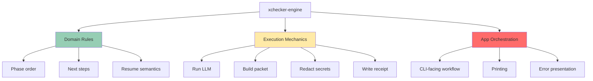
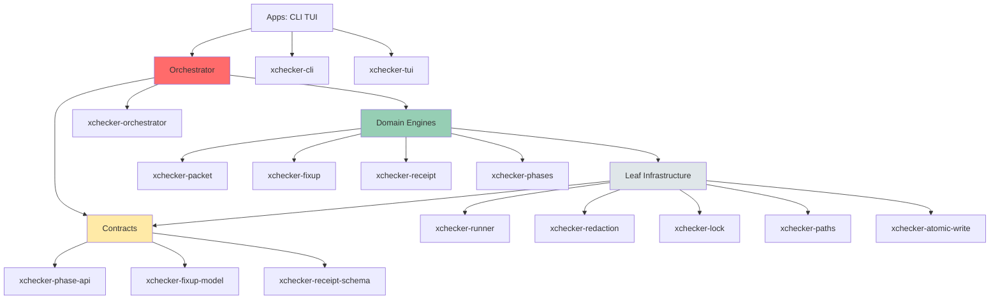
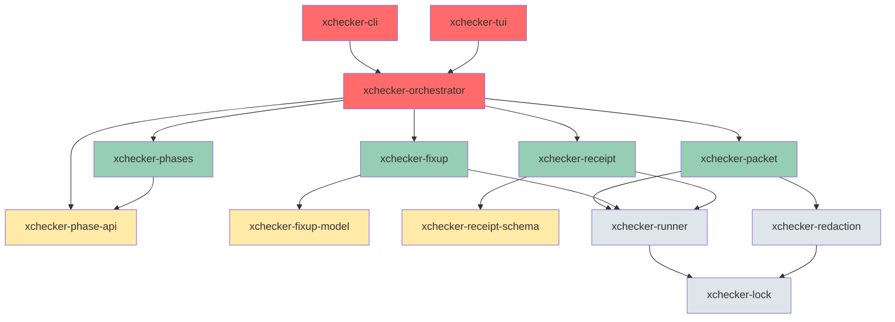

# xchecker SRP Microcrate Analysis

**Document Version**: 2.1  
**Date**: 2026-01-28  
**Project**: xchecker  
**Current Version**: 1.0.0  
**Rust Edition**: 2024  
**Base Ref**: main (2026-01-28)

---

## Source of Truth

This document is grounded in actual workspace state. The following commands were used to verify current workspace members:

```bash
# Count workspace members
cargo metadata --format-version 1 --no-deps | jq '.workspace_members | length'

# List all workspace member names
cargo metadata --format-version 1 --no-deps | jq -r '.packages[].name' | sort

# List crates in crates/ directory
ls -1 crates/
```

**Workspace Members (23 total)**: The crates that are currently compiled in CI as defined in [`Cargo.toml`](../Cargo.toml:2-26).

**Crates Present but Not in Workspace**: The crates that exist in `crates/` directory but are not yet added to workspace members.

---

## Executive Summary

This analysis identifies opportunities for extracting Single Responsibility Principle (SRP) microcrates from the xchecker codebase. The analysis distinguishes between the current state (main branch) and the target state (planned architecture), focusing on crate splits that provide real value based on a rigorous evaluation framework.

**Key Findings:**
- xchecker-engine mixes three distinct responsibilities: domain rules, execution mechanics, and app orchestration
- Several crates already exist but are not yet in the workspace (xchecker-fixup-model, xchecker-phases, xchecker-workspace, xchecker-hooks)
- The analysis focuses on crate splits that provide: dependency direction, testability, feature gating, reuse, or blast radius benefits

**Recommendations:**
- Create 3 high-impact microcrates: xchecker-cli, xchecker-orchestrator, xchecker-phase-api
- Create 2 medium-impact microcrates: xchecker-fixup-model, xchecker-receipt
- Keep execution concerns as modules within orchestrator crate, not separate crates

---

## Part 1: Current State (Main Branch)

### 1.1 Existing Crate Structure

The workspace currently has the following members in [`Cargo.toml`](../Cargo.toml:2-26):

| Crate | Purpose | Status | Notes |
|-------|---------|--------|-------|
| **xchecker** | Root crate / facade | Stable | Re-exports from src/ |
| **xchecker-utils** | Foundation utilities | Stable | Contains runner, redaction, lock, paths, etc. |
| **xchecker-config** | Configuration management | Stable | Well-encapsulated |
| **xchecker-llm** | LLM provider abstraction | Stable | Well-designed trait system |
| **xchecker-engine** | Core orchestration | Needs decomposition | Multiple responsibilities |
| **xchecker-gate** | CI/CD gate enforcement | Stable | Extracted from engine |
| **xchecker-phase-api** | Phase trait definitions | Stable | Phase contracts |
| **xchecker-packet** | Packet building | Stable | Extracted from engine |
| **xchecker-receipt** | Receipt generation | Stable | Extracted from engine |
| **xchecker-error-reporter** | Error display | Stable | Extracted from src/ |
| **xchecker-tui** | Terminal UI | Stable | Extracted from src/ |
| **xchecker-prompt-template** | Prompt templating | Stable | Extracted from engine |
| **xchecker-selectors** | Content selectors | Stable | Extracted from config |
| **xchecker-error-redaction** | Error redaction | Stable | Error handling |
| **xchecker-redaction** | Secret redaction | Stable | Extracted from utils |
| **xchecker-runner** | Process execution | Stable | Extracted from utils |
| **xchecker-lock** | Lock management | Stable | Extracted from utils |
| **xchecker-status** | Status queries | Stable | Extracted from engine |
| **xchecker-templates** | Template management | Stable | Extracted from engine |
| **xchecker-doctor** | Health diagnostics | Stable | Extracted from engine |
| **xchecker-benchmark** | Performance benchmarking | Stable | Extracted from engine |
| **xchecker-validation** | Validation logic | Stable | Extracted from engine |
| **xchecker-extraction** | Content extraction | Stable | Extracted from engine |

**Note**: The following crates exist in the `crates/` directory but are NOT yet in the workspace members:
- `xchecker-fixup-model` - Fixup model types
- `xchecker-phases` - Phase implementations
- `xchecker-workspace` - Workspace management
- `xchecker-hooks` - Hook system

### 1.2 xchecker-engine Current Structure

```
crates/xchecker-engine/src/
├── orchestrator/
│   ├── mod.rs
│   ├── handle.rs
│   ├── llm.rs
│   ├── phase_exec.rs
│   └── workflow.rs
├── fixup/
│   ├── mod.rs
│   ├── model.rs
│   ├── parse.rs
│   ├── apply.rs
│   ├── match_context.rs
│   ├── paths.rs
│   ├── phase.rs
│   └── report.rs
├── packet/ (moved to xchecker-packet)
├── receipt/ (moved to xchecker-receipt)
├── phase.rs
├── phases.rs
├── example_generators.rs
├── integration_tests.rs
├── claude.rs
└── lib.rs
```

### 1.3 src/ Directory Structure

```
src/
├── main.rs
├── lib.rs
├── cli.rs (large file with mixed concerns)
├── tui.rs (822 lines - extracted to xchecker-tui)
├── error_reporter.rs (1223 lines - extracted to xchecker-error-reporter)
└── bin/
    ├── claude-stub.rs
    ├── regenerate_examples.rs
    └── regenerate_secret_patterns_docs.rs
```

---

## Part 2: The Real SRP Violation

### 2.1 Three Kinds of Work in xchecker-engine

xchecker-engine currently mixes three distinct types of work that need different tests, different owners, and different change cadence:



### 2.2 Why This Matters

| Aspect | Domain Rules | Execution Mechanics | App Orchestration |
|--------|--------------|-------------------|-------------------|
| **Testability** | Pure logic, no I/O | Needs mocks, integration tests | Needs CLI fixtures |
| **Owner** | Product/Domain | Platform/Infra | UX/CLI |
| **Change Cadence** | Rare, breaking changes | Medium, optimizations | Frequent, UX iterations |
| **Dependencies** | Minimal (types only) | Heavy (IO, LLM, etc.) | Heavy (all crates) |

---

## Part 3: Target Architecture (4 Layers)

### 3.1 Layer Overview



### 3.2 Layer 1: Contracts (Tiny, Stable)

| Crate | Purpose | Status |
|-------|---------|--------|
| **xchecker-phase-api** | Owns Phase, PhaseContext, PhaseResult, NextStep, PhaseId | **Exists** - High priority to consolidate |
| **xchecker-fixup-model** | Owns fixup IR types, mode enums, conflict types | **Exists (not in workspace)** - Needs to be added |
| **xchecker-receipt-schema** | Owns receipt structs + serde, schema version constants | **Proposed** - Optional, could stay in xchecker-receipt |

**Rationale**: These crates provide the contracts that higher layers depend on. They are tiny, stable, and enable dependency inversion.

### 3.3 Layer 2: Leaf Infrastructure (Platform/Security/IO)

| Crate | Purpose | Status |
|-------|---------|--------|
| **xchecker-runner** | Process execution + platform kill semantics | **Exists** - Already extracted |
| **xchecker-redaction** | Patterns + redact engine | **Exists** - Already extracted |
| **xchecker-lock** | Locking semantics, file coordination | **Exists** - Already extracted |
| **xchecker-paths** | Canonicalization/sandbox rules | **Proposed** - Only if utils stays too fat |
| **xchecker-atomic-write** | Hard-isolate IO correctness | **Proposed** - Optional, currently in utils |

**Rationale**: These crates have no dependencies on domain logic. They are leaf nodes in the dependency DAG.

### 3.4 Layer 3: Domain Engines (The Work)

| Crate | Purpose | Status |
|-------|---------|--------|
| **xchecker-packet** | Selectors + budget + packet assembly | **Exists** - Keep as one crate until stable |
| **xchecker-fixup** | Owns parse/apply/report, depends on xchecker-fixup-model | **Proposed** - Consolidate fixup/ from engine |
| **xchecker-receipt** | Write/read receipts | **Exists** - Already extracted |
| **xchecker-phases** | Requirements/Design/Tasks/Review implementations | **Exists (not in workspace)** - Needs to be added |

**Rationale**: These crates do the actual work. They depend on contracts and leaf infrastructure.

### 3.5 Layer 4: Orchestrator and Apps

| Crate | Purpose | Status |
|-------|---------|--------|
| **xchecker-orchestrator** | Workflow + phase execution in one place | **Proposed** - Extract from engine/orchestrator/ |
| **xchecker-cli** | CLI parsing + command dispatch | **Proposed** - Extract from src/cli.rs |
| **xchecker-tui** | Terminal UI | **Exists** - Already extracted |

**Rationale**: These are the UX surfaces. They depend on everything below.

### 3.6 xchecker-engine as Facade

During migration, `xchecker-engine` becomes a facade that re-exports stable paths:

```rust
// crates/xchecker-engine/src/lib.rs
// During migration: re-export for backward compatibility
pub use xchecker_phase_api as phases;
pub use xchecker_orchestrator as orchestrator;

// Eventually: deprecate and remove
```

---

## Part 4: Crate Split Evaluation Framework

### 4.1 When Is a Crate Split Worth It?

A crate split is worth it when it buys at least one of:

| Criterion | Description | Example |
|-----------|-------------|---------|
| **Dependency Direction** | Prevents cycles by moving types/contracts down the DAG | xchecker-phase-api enables phase implementations to depend on contracts, not each other |
| **Testability** | Leaf crate can be tested without orchestrator scaffolding | xchecker-runner can test process execution in isolation |
| **Feature Gating** | Platform/dev-tools separation without contaminating core | xchecker-runner can have platform-specific features |
| **Reuse** | Multiple crates legitimately consume the same thing | xchecker-fixup-model used by fixup, orchestrator, and CLI |
| **Blast Radius** | Changes land in one crate with obvious owners and gates | xchecker-cli isolates UX churn from core |

### 4.2 When Is a Crate Split NOT Worth It?

A crate split is NOT worth it when:

| Anti-Pattern | Description | Example |
|--------------|-------------|---------|
| **Module Masquerading** | Just a module, not a real crate | xchecker-phase-transitions - belongs in phase-api or orchestrator |
| **Versioning Friction** | Creates more feature flags and circular dependencies | xchecker-workflow-execution - tightly coupled to orchestrator |
| **No Dependency Benefit** | Doesn't change the DAG shape | xchecker-orchestrator-config - config mapping is internal to orchestrator |

### 4.3 Crates vs Modules: A Rule

**Rule**: Crates are for contracts + leaf infra + app surfaces. Modules are for execution mechanics inside domain engines.

| When to use a Crate | When to use a Module |
|---------------------|----------------------|
| **Contracts** (types, traits) | Always use a crate - enables dependency inversion |
| **Leaf Infrastructure** (platform, IO) | Always use a crate - enables feature gating and reuse |
| **App Surfaces** (CLI, TUI) | Always use a crate - isolates UX churn |
| **Execution Mechanics** | Usually a module - keeps related logic together |
| **Domain Engines** | Use a crate when there are multiple consumers or clear boundary |

**Examples**:
- ✅ `xchecker-phase-api` as crate (contracts)
- ✅ `xchecker-runner` as crate (leaf infra)
- ✅ `xchecker-cli` as crate (app surface)
- ❌ `xchecker-phase-transitions` as crate (belongs in orchestrator as module)
- ❌ `xchecker-workflow-execution` as crate (tightly coupled to orchestrator)

---

## Part 5: Concrete Microcrates Worth Doing

### 5.1 High Impact

#### 1. xchecker-phase-api (Consolidate and Standardize)

**Impact**: Eliminates duplicate Phase types and prevents the exact class of failures you just hit.

**Current State**: Phase trait exists but types may be duplicated across crates.

**Target State**: Single source of truth for Phase contracts.

```rust
// crates/xchecker-phase-api/src/lib.rs
pub use self::phase::{Phase, PhaseContext, PhaseResult};
pub use self::transition::{NextStep, PhaseId};
```

**Benefits**:
- **Dependency Direction**: Phase implementations depend on contracts, not each other
- **Testability**: Phases can be tested via trait without orchestrator
- **Blast Radius**: Changes to Phase contract are isolated

**Migration**:
1. Audit all crates for duplicate Phase types
2. Consolidate into xchecker-phase-api
3. Update all imports
4. Add tests for contract invariants

---

#### 2. xchecker-orchestrator (Extract as Real Crate)

**Impact**: Lets xchecker-engine shrink into a facade. Workflow + phase execution in one place.

**Current State**: [`crates/xchecker-engine/src/orchestrator/`](../crates/xchecker-engine/src/orchestrator/) is a module.

**Target State**: `crates/xchecker-orchestrator/` as a real crate.

**Structure**:
```
crates/xchecker-orchestrator/src/
├── lib.rs
├── workflow.rs       # Complete workflow execution
├── phase_exec.rs    # Phase execution mechanics
├── transitions.rs    # Phase transition rules (as module, not crate)
└── llm.rs          # LLM invocation coordination
```

**Benefits**:
- **Blast Radius**: Orchestrator changes are isolated
- **Testability**: Workflow can be tested independently
- **Reuse**: Could support alternative orchestrators in future

**Migration**:
1. Create `crates/xchecker-orchestrator/` crate
2. Move orchestrator/ module contents
3. Update xchecker-engine to re-export
4. Run tests

---

#### 3. xchecker-cli (Extract from src/)

**Impact**: Improves testability and keeps UX churn away from core.

**Current State**: [`src/cli.rs`](../src/cli.rs:1) (large file) + CLI logic in [`src/lib.rs`](../src/lib.rs:1).

**Target State**: `crates/xchecker-cli/` as a real crate.

**Structure**:
```
crates/xchecker-cli/src/
├── lib.rs
├── commands/        # CLI command definitions
├── parser.rs        # Argument parsing
└── executor.rs      # Command execution
```

**Benefits**:
- **Testability**: CLI can be tested without binary
- **Blast Radius**: UX changes isolated from core
- **Feature Gating**: CLI-specific features don't pollute core

**Migration**:
1. Create `crates/xchecker-cli/` crate
2. Move CLI logic from src/
3. Update src/main.rs to use xchecker-cli
4. Run CLI tests

---

### 5.2 Medium Impact

#### 4. xchecker-fixup-model (Add to Workspace)

**Impact**: Prevents cycles and type duplication. Fixup types live below fixup/orchestrator.

**Current State**: `crates/xchecker-fixup-model/` exists but NOT in workspace members.

**Target State**: Add to workspace and ensure all fixup types come from here.

```rust
// crates/xchecker-fixup-model/src/lib.rs
pub use self::diff::{DiffHunk, UnifiedDiff};
pub use self::mode::{FixupMode, FixupConflict};
pub use self::error::FixupError;
```

**Benefits**:
- **Dependency Direction**: Fixup implementation depends on model, not vice versa
- **Reuse**: Multiple crates can use fixup types
- **Blast Radius**: Fixup model changes are isolated

**Migration**:
1. Add to workspace members in Cargo.toml
2. Audit for duplicate fixup types
3. Consolidate into xchecker-fixup-model
4. Update imports

---

#### 5. xchecker-receipt (or receipt-schema)

**Impact**: Receipts are the core artifact. Treat them like a first-class engine.

**Current State**: `xchecker-receipt` exists and is in workspace.

**Target State**: Either keep as-is, or split schema into `xchecker-receipt-schema` for stability.

**Benefits**:
- **Dependency Direction**: Receipt schema is a contract
- **Testability**: Receipt validation can be tested independently
- **Reuse**: Multiple tools can validate receipts

**Migration**:
1. Evaluate if schema needs separate crate
2. If yes, extract xchecker-receipt-schema
3. Update dependencies

---

### 5.3 Low Impact (Do Later)

#### 6. Artifact Manager (Module, Not Crate)

**Impact**: Likely a module in receipt/workspace, not a separate crate.

**Rationale**: Artifact management is tightly coupled to receipt and workspace. Splitting it doesn't provide dependency direction or testability benefits.

**Recommendation**: Keep as module in xchecker-receipt or xchecker-workspace.

---

#### 7. Phase Transitions (Module, Not Crate)

**Impact**: Belongs inside phase-api (as pure rules) or inside orchestrator as a module.

**Rationale**: Phase transition rules are pure logic that depends only on PhaseId. They don't need a separate crate.

**Recommendation**: 
- Option 1: Move to xchecker-phase-api as pure rules
- Option 2: Keep as module in xchecker-orchestrator

---

## Part 6: Wave-Based Migration Strategy

### 6.1 Wave Definition

Each wave has a **Definition of Done**:
- [ ] All crates in wave are created or modified
- [ ] All tests pass (`cargo test --workspace --all-features`)
- [ ] No circular dependencies (`cargo tree --duplicates`)
- [ ] Documentation updated
- [ ] Re-exports in place for backward compatibility
- [ ] `cargo build --all-features` succeeds (build gate, not just test)
- [ ] No duplicate types across crate boundaries
- [ ] All imports use new crate paths where applicable

### 6.2 Wave 1: High Impact (Foundation)

**Goal**: Establish the foundation with high-impact crates.

**Crates**:
1. xchecker-phase-api (consolidate)
2. xchecker-orchestrator (extract)
3. xchecker-cli (extract)

**Definition of Done**:
- [ ] xchecker-phase-api has no duplicate Phase types
- [ ] xchecker-orchestrator is a real crate with workflow/phase execution
- [ ] xchecker-cli is a real crate with all CLI logic
- [ ] xchecker-engine re-exports for backward compatibility
- [ ] All tests pass with `--all-features`
- [ ] `cargo build --all-features` succeeds
- [ ] No circular dependencies detected
- [ ] Documentation updated (CLAUDE.md, architecture docs)

**Risks**:
- Breaking changes for external consumers
- Need to maintain stable paths during migration

**Mitigation**:
- Use `pub use` re-exports in xchecker-engine
- Deprecate old paths with warnings
- Support both old and new APIs during transition

---

### 6.3 Wave 2: Medium Impact (Consolidation)

**Goal**: Consolidate fixup and receipt types.

**Crates**:
1. xchecker-fixup-model (add to workspace)
2. xchecker-receipt (or split schema)

**Definition of Done**:
- [ ] xchecker-fixup-model is in workspace
- [ ] All fixup types consolidated
- [ ] Receipt schema stable (or split)
- [ ] All tests pass with `--all-features`
- [ ] `cargo build --all-features` succeeds
- [ ] No circular dependencies detected

**Risks**:
- Duplicate types may exist
- Integration with existing fixup logic

**Mitigation**:
- Audit for duplicates before migration
- Run comprehensive integration tests

---

### 6.4 Wave 3: Cleanup (Facade Removal)

**Goal**: Remove xchecker-engine facade and complete migration.

**Actions**:
1. Remove re-exports from xchecker-engine
2. Deprecate old paths
3. Update all imports
4. Remove unused code

**Definition of Done**:
- [ ] xchecker-engine is minimal or removed
- [ ] All imports use new crate paths
- [ ] All tests pass with `--all-features`
- [ ] `cargo build --all-features` succeeds
- [ ] Documentation reflects new structure
- [ ] Migration guide created

**Risks**:
- External consumers may still use old paths
- Breaking changes

**Mitigation**:
- Provide migration guide
- Maintain deprecation period
- Semantic versioning

---

### 6.5 Wave 4: Future Work (Optional)

**Goal**: Address low-impact items if needed.

**Items**:
1. Evaluate xchecker-paths (if utils stays too fat)
2. Evaluate xchecker-atomic-write (if needed)
3. Artifact manager as module
4. Phase transitions as module

**Definition of Done**:
- [ ] Evaluate each item against framework
- [ ] Implement only if provides real value
- [ ] All tests pass
- [ ] `cargo build --all-features` succeeds

---

## Part 7: Migration Principles

### 7.1 Move Types First, Then Implementations

1. Extract contracts to new crate
2. Update dependents to use new contracts
3. Move implementations
4. Remove old code

### 7.2 Keep Stable Paths via Facade

During migration, maintain backward compatibility:
```rust
// In xchecker-engine/src/lib.rs
pub use xchecker_phase_api::Phase;
pub use xchecker_orchestrator::OrchestratorHandle;
```

Do NOT remove facade until last dependent moves.

### 7.3 Treat `--all-features` as the Build

If `cargo build --all-features` fails, the wave is not done.

### 7.4 No `pub use` Until All Phases Move

Do NOT use `pub use xchecker_phases as phases;` until every phase (including Fixup) has moved.

### 7.5 Cycle Prevention Checklist

Before completing any wave, verify:

- [ ] No circular dependencies in workspace (`cargo tree --duplicates` returns nothing)
- [ ] Dependency graph is acyclic (no A -> B -> A paths)
- [ ] All contract crates have minimal dependencies (only types, no domain logic)
- [ ] No duplicate type definitions across crate boundaries
- [ ] All new crates can be built independently
- [ ] No workspace member depends on another workspace member's internal modules only

---

## Part 8: Risks and Mitigation

### 8.1 Technical Risks

| Risk | Probability | Impact | Mitigation |
|-------|-------------|--------|------------|
| **Breaking Changes** | Medium | High | Maintain re-exports, version bump |
| **Circular Dependencies** | Low | High | Use dependency graph analysis tools |
| **Test Coverage Gaps** | Medium | Medium | Comprehensive test suite |
| **Performance Regression** | Low | Medium | Benchmark before/after |
| **API Instability** | Low | High | Semantic versioning, deprecation period |

### 8.2 Mitigation Strategies

1. **Maintain Backward Compatibility**
   - Use `pub use` re-exports in xchecker-engine
   - Deprecate old paths with warnings
   - Provide migration guide
   - Support both old and new APIs during transition

2. **Prevent Circular Dependencies**
   - Use `cargo tree --duplicates` to detect issues
   - Enforce dependency rules in CI
   - Document allowed dependency patterns

3. **Ensure Test Coverage**
   - Run full test suite after each wave
   - Add integration tests for new crate boundaries
   - Use property-based testing for trait implementations

4. **Performance Benchmarking**
   - Benchmark critical paths before extraction
   - Benchmark after extraction
   - Compare and optimize if regression detected

5. **API Stability Management**
   - Use semantic versioning
   - Document stability guarantees
   - Provide deprecation timeline
   - Use feature flags for unstable APIs

---

## Part 9: Success Criteria

### 9.1 Technical Criteria

- [ ] All new crates have clear, single responsibilities
- [ ] No circular dependencies in workspace
- [ ] Each crate has focused, testable API
- [ ] Dependency inversion applied where appropriate
- [ ] Public APIs are stable and well-documented
- [ ] Internal implementation details are hidden

### 9.2 Process Criteria

- [ ] Full test suite passes with `--all-features`
- [ ] `cargo build --all-features` succeeds
- [ ] No regression in functionality
- [ ] Documentation updated
- [ ] Migration guide created
- [ ] Code review completed

### 9.3 Quality Criteria

- [ ] Code follows Rust best practices
- [ ] Error handling is comprehensive
- [ ] Logging is appropriate
- [ ] Security considerations addressed
- [ ] Performance is acceptable

---

## Part 10: Conclusion

The xchecker codebase has significant modularization opportunities, but the previous analysis mixed current state with target state and proposed too many microcrates that are really just modules.

**Key Insights**:

1. **The Real SRP Violation**: xchecker-engine mixes three kinds of work (domain rules, execution mechanics, app orchestration) that need different tests, owners, and change cadence.

2. **Target Architecture**: 4 layers (Contracts, Leaf Infrastructure, Domain Engines, Orchestrator and Apps) provide clear separation of concerns.

3. **High Impact Microcrates**: xchecker-phase-api, xchecker-orchestrator, and xchecker-cli provide the most value by enabling dependency direction, testability, and blast radius benefits.

4. **Medium Impact**: xchecker-fixup-model and xchecker-receipt consolidate types and prevent cycles.

5. **Low Impact**: Items like artifact manager and phase transitions should remain as modules, not crates.

6. **Wave-Based Migration**: Each wave has a clear definition of done, and `--all-features` is the build gate.

The migration should be approached incrementally, with careful attention to backward compatibility and test coverage. Each wave should be validated with a comprehensive test suite before proceeding to the next.

---

## Appendix A: Dependency Graph (Target State)



---

## Appendix B: Evaluation Framework Checklist

When evaluating a potential crate split, ask:

- [ ] **Dependency Direction**: Does this move types down the DAG?
- [ ] **Testability**: Can this be tested independently?
- [ ] **Feature Gating**: Does this enable platform/dev-tools separation?
- [ ] **Reuse**: Will multiple crates legitimately consume this?
- [ ] **Blast Radius**: Does this isolate changes to obvious owners?

If the answer is NO to all, it's likely a module, not a crate.

---

**Document Information**

| Field | Value |
|--------|--------|
| Version | 2.1 |
| Date | 2026-01-28 |
| Author | SRP Analysis Team |
| Status | Draft - Pending Review |
| Next Review Date | TBD |
