# xchecker SRP Microcrate Analysis

**Document Version**: 1.0  
**Date**: 2026-01-28  
**Project**: xchecker  
**Current Version**: 1.0.0  
**Rust Edition**: 2024

---

## Executive Summary

This analysis identifies opportunities for extracting Single Responsibility Principle (SRP) microcrates from the xchecker codebase. The project has already undergone significant modularization since the original modularization report (v4.0, 2026-01-17), with 7 new crates created. However, additional SRP violations and opportunities remain.

**Key Findings:**
- 7 new crates have been created since the original report
- xchecker-engine remains a large, multi-responsibility crate
- xchecker-utils still contains runner module (already extracted)
- src/ directory still contains large CLI file (5471 lines)
- xchecker-llm has well-abstracted provider traits but mixed concerns

**Recommendations:**
- Create 9 additional microcrates for SRP compliance
- Extract CLI layer into dedicated crate
- Further decompose xchecker-engine orchestrator module
- Create interface/contract crates for better abstraction

---

## 1. Current Architecture Status

### 1.1 Existing Crate Structure (Post-Modularization)

| Crate | Purpose | Status | Notes |
|-------|---------|--------|-------|
| **xchecker-utils** | Foundation utilities | Partially modularized | Runner module still embedded |
| **xchecker-config** | Configuration management | Stable | Well-encapsulated |
| **xchecker-llm** | LLM provider abstraction | Stable | Well-designed trait system |
| **xchecker-engine** | Core orchestration | Needs decomposition | Multiple responsibilities |
| **xchecker-receipt** | Receipt generation | **NEW** | Extracted from engine |
| **xchecker-redaction** | Secret redaction | **NEW** | Extracted from utils |
| **xchecker-runner** | Process execution | **NEW** | Extracted from utils |
| **xchecker-status** | Status queries | **NEW** | Extracted from engine |
| **xchecker-templates** | Template management | **NEW** | Extracted from engine |
| **xchecker-tui** | Terminal UI | **NEW** | Extracted from src/ |
| **xchecker-validation** | Validation logic | **NEW** | Extracted from engine |
| **xchecker-workspace** | Workspace management | **NEW** | Extracted from engine |
| **xchecker-gate** | CI/CD gate enforcement | **NEW** | Extracted from engine |
| **xchecker-hooks** | Hook system | **NEW** | Extracted from engine |
| **xchecker-benchmark** | Performance benchmarking | **NEW** | Extracted from engine |
| **xchecker-doctor** | Health diagnostics | **NEW** | Extracted from engine |
| **xchecker-extraction** | Content extraction | **NEW** | Extracted from engine |
| **xchecker-fixup-model** | Fixup model types | **NEW** | Fixup types extracted |
| **xchecker-packet** | Packet building | **NEW** | Extracted from engine |
| **xchecker-phase-api** | Phase trait definitions | **NEW** | Phase contracts |
| **xchecker-selectors** | Content selectors | **NEW** | Extracted from config |
| **xchecker-lock** | Lock management | **NEW** | Extracted from utils |
| **xchecker-prompt-template** | Prompt templating | **NEW** | Extracted from engine |
| **xchecker-error-redaction** | Error redaction | **NEW** | Error handling |
| **xchecker-error-reporter** | Error reporting | **NEW** | Error display |

### 1.2 xchecker-engine Current Structure

```
crates/xchecker-engine/src/
├── orchestrator/
│   ├── mod.rs (897 lines)
│   ├── handle.rs (731 lines)
│   ├── llm.rs
│   ├── phase_exec.rs
│   └── workflow.rs
├── fixup/
│   ├── mod.rs (71 lines)
│   ├── model.rs (9 lines - re-export)
│   ├── parse.rs (447 lines)
│   ├── apply.rs
│   ├── match_context.rs
│   ├── paths.rs
│   ├── phase.rs
│   └── report.rs
├── packet/ (empty - moved to xchecker-packet)
├── receipt/ (empty - moved to xchecker-receipt)
├── phase.rs
├── phases.rs
├── example_generators.rs
├── integration_tests.rs
├── claude.rs
└── lib.rs
```

### 1.3 xchecker-utils Current Structure

```
crates/xchecker-utils/src/
├── atomic_write.rs
├── cache.rs
├── canonicalization.rs
├── error.rs
├── exit_codes.rs
├── lock.rs
├── logging.rs
├── paths.rs
├── process_memory.rs
├── ring_buffer.rs
├── runner/ (13 files - already extracted to xchecker-runner)
├── source.rs
├── spec_id.rs
├── test_support.rs
└── types.rs
```

### 1.4 src/ Directory Structure

```
src/
├── main.rs
├── lib.rs
├── cli.rs (5471 lines - very large)
├── tui.rs (822 lines - already extracted)
├── error_reporter.rs (1223 lines - already extracted)
└── bin/
    ├── claude-stub.rs
    ├── regenerate_examples.rs
    └── regenerate_secret_patterns_docs.rs
```

---

## 2. SRP Violations and Opportunities

### 2.1 High Priority Opportunities

#### Opportunity 1: Extract CLI Layer into xchecker-cli Crate

**Name**: `xchecker-cli`

**Purpose**: CLI command orchestration, argument parsing, and command execution

**Current Location**: 
- [`src/cli.rs`](../src/cli.rs:1) (5471 lines)
- [`src/lib.rs`](../src/lib.rs:1) (public API facade)
- [`src/main.rs`](../src/main.rs:1) (binary entry point)

**Components to Extract**:
- CLI command definitions and handlers
- Argument parsing logic
- Command execution orchestration
- CLI-specific error handling
- CLI-specific configuration

**Dependencies**:
- xchecker-engine (via OrchestratorHandle)
- xchecker-config
- xchecker-llm
- xchecker-utils
- All other domain crates

**Dependents**:
- src/main.rs (binary entry point)

**Rationale**:
- **SRP Violation**: CLI layer has multiple responsibilities mixed together:
  - Command definition
  - Argument parsing
  - Command execution
  - Output formatting
  - Error handling
- **Testability**: CLI logic can be tested independently without binary
- **Reusability**: CLI crate could be reused for alternative frontends
- **Maintainability**: 5471-line file is difficult to navigate and maintain
- **Separation of Concerns**: CLI concerns are distinct from library concerns

**Migration Strategy**:
1. Create `crates/xchecker-cli/` directory structure
2. Move `src/cli.rs` to `crates/xchecker-cli/src/cli.rs`
3. Move CLI-specific modules from `src/lib.rs` to xchecker-cli
4. Update `src/main.rs` to use xchecker-cli
5. Update workspace Cargo.toml
6. Run tests to verify CLI functionality preserved

**Risks**:
- Breaking changes for external consumers of xchecker-engine library
- Need to maintain backward compatibility via re-exports

---

#### Opportunity 2: Extract Orchestrator Config Conversion Logic

**Name**: `xchecker-orchestrator-config`

**Purpose**: Configuration conversion from Config to OrchestratorConfig

**Current Location**:
- [`crates/xchecker-engine/src/orchestrator/handle.rs`](../crates/xchecker-engine/src/orchestrator/handle.rs:182-349) (168 lines of config conversion logic)

**Components to Extract**:
- `from_config_internal()` function (lines 182-349)
- Config to OrchestratorConfig mapping logic
- Redactor construction from config
- Hooks configuration mapping

**Dependencies**:
- xchecker-config
- xchecker-redaction
- xchecker-hooks

**Dependents**:
- xchecker-engine (OrchestratorHandle)
- xchecker-cli (if created)

**Rationale**:
- **SRP Violation**: Config conversion is a distinct responsibility from orchestration logic
- **Testability**: Config conversion logic can be tested independently
- **Reusability**: Config conversion could be reused by other orchestrator implementations
- **Complexity**: 168 lines of config mapping mixed with orchestration logic
- **Single Responsibility**: Config conversion should have its own crate

**Migration Strategy**:
1. Create `crates/xchecker-orchestrator-config/` crate
2. Extract config conversion logic from handle.rs
3. Create trait for config conversion
4. Update OrchestratorHandle to use new crate
5. Run tests to verify config conversion

**Risks**:
- Internal implementation details may be exposed
- Need to maintain backward compatibility

---

#### Opportunity 3: Extract Phase Transition Validation Logic

**Name**: `xchecker-phase-transitions`

**Purpose**: Phase transition validation and workflow state management

**Current Location**:
- [`crates/xchecker-engine/src/orchestrator/mod.rs`](../crates/xchecker-engine/src/orchestrator/mod.rs:267-372) (validate_transition, get_current_phase, check_dependencies_satisfied)
- [`crates/xchecker-engine/src/orchestrator/mod.rs`](../crates/xchecker-engine/src/orchestrator/mod.rs:306-372) (can_resume_from_phase)

**Components to Extract**:
- Phase transition validation rules
- Dependency checking logic
- Current phase state detection
- Legal transition computation
- Resume capability checking

**Dependencies**:
- xchecker-utils (for PhaseId)
- xchecker-receipt (for receipt reading)

**Dependents**:
- xchecker-engine (PhaseOrchestrator)
- xchecker-cli (if created)

**Rationale**:
- **SRP Violation**: Workflow state management is a distinct concern from phase execution
- **Testability**: Transition rules can be tested independently
- **Reusability**: Transition logic could be reused by alternative orchestrators
- **Domain Logic**: Phase transitions are core domain logic, not orchestration detail
- **Complexity**: Mixed with orchestration lifecycle management

**Migration Strategy**:
1. Create `crates/xchecker-phase-transitions/` crate
2. Extract transition validation functions
3. Create PhaseTransition trait or struct
4. Update PhaseOrchestrator to use new crate
5. Run tests for transition validation

**Risks**:
- Tight coupling with PhaseOrchestrator internals
- Need to expose internal state for validation

---

#### Opportunity 4: Extract LLM Provider Configuration Logic

**Name**: `xchecker-llm-config`

**Purpose**: LLM provider configuration and backend selection logic

**Current Location**:
- [`crates/xchecker-engine/src/orchestrator/llm.rs`](../crates/xchecker-engine/src/orchestrator/llm.rs)
- Provider selection logic embedded in orchestrator

**Components to Extract**:
- LLM provider selection based on config
- Backend binary path resolution
- Provider-specific configuration handling
- Fallback provider logic

**Dependencies**:
- xchecker-config
- xchecker-llm (provider traits)

**Dependents**:
- xchecker-engine (orchestrator)
- xchecker-cli (if created)

**Rationale**:
- **SRP Violation**: Provider configuration is distinct from LLM invocation
- **Testability**: Provider selection can be tested independently
- **Reusability**: Config logic could be reused by different orchestrator implementations
- **Single Responsibility**: Provider configuration is a separate concern from execution

**Migration Strategy**:
1. Create `crates/xchecker-llm-config/` crate
2. Extract provider selection logic from orchestrator/llm.rs
3. Create ProviderConfig trait
4. Update orchestrator to use new crate
5. Run tests for provider selection

**Risks**:
- LLM provider backends may need refactoring
- Configuration mapping complexity

---

### 2.2 Medium Priority Opportunities

#### Opportunity 5: Extract Workflow Execution Logic

**Name**: `xchecker-workflow-execution`

**Purpose**: Complete workflow execution and multi-phase orchestration

**Current Location**:
- [`crates/xchecker-engine/src/orchestrator/workflow.rs`](../crates/xchecker-engine/src/orchestrator/workflow.rs)

**Components to Extract**:
- Complete workflow execution from start to finish
- Multi-phase coordination
- Workflow state management
- Error handling across phases

**Dependencies**:
- xchecker-engine (orchestrator)
- xchecker-phase-transitions (if created)
- xchecker-receipt

**Dependents**:
- xchecker-engine (orchestrator/handle)
- xchecker-cli (if created)

**Rationale**:
- **SRP Violation**: Complete workflow execution is distinct from single-phase execution
- **Testability**: Workflow scenarios can be tested independently
- **Reusability**: Workflow logic could be reused for different execution strategies
- **Separation of Concerns**: Workflow orchestration vs phase orchestration

**Migration Strategy**:
1. Create `crates/xchecker-workflow-execution/` crate
2. Extract workflow execution logic
3. Create WorkflowExecutor trait
4. Update OrchestratorHandle to use new crate
5. Run tests for workflow execution

**Risks**:
- May duplicate some orchestrator functionality
- Need clear separation of responsibilities

---

#### Opportunity 6: Extract Fixup Match Context Logic

**Name**: `xchecker-fixup-match`

**Purpose**: Diff hunk matching and context extraction for fixup application

**Current Location**:
- [`crates/xchecker-engine/src/fixup/match_context.rs`](../crates/xchecker-engine/src/fixup/match_context.rs)

**Components to Extract**:
- Diff hunk matching algorithms
- Context extraction from source files
- Line number mapping
- Fuzzy matching logic

**Dependencies**:
- xchecker-fixup-model
- xchecker-utils (paths)

**Dependents**:
- xchecker-engine (fixup/apply)
- xchecker-fixup (if extracted as separate crate)

**Rationale**:
- **SRP Violation**: Match context finding is a distinct concern from diff application
- **Testability**: Matching algorithms can be tested independently
- **Reusability**: Match logic could be reused by other diff tools
- **Complexity**: Fuzzy matching is complex and deserves its own module

**Migration Strategy**:
1. Create `crates/xchecker-fixup-match/` crate
2. Extract match context logic
3. Create DiffMatcher trait
4. Update fixup/apply to use new crate
5. Run tests for matching logic

**Risks**:
- Performance characteristics of matching algorithms
- Integration with existing fixup logic

---

#### Opportunity 7: Extract Phase Execution Engine

**Name**: `xchecker-phase-execution`

**Purpose**: Low-level phase execution engine with LLM invocation

**Current Location**:
- [`crates/xchecker-engine/src/orchestrator/phase_exec.rs`](../crates/xchecker-engine/src/orchestrator/phase_exec.rs)

**Components to Extract**:
- Phase execution orchestration
- LLM invocation coordination
- Secret scanning integration
- Artifact generation
- Receipt generation

**Dependencies**:
- xchecker-phase-api (Phase trait)
- xchecker-packet
- xchecker-receipt
- xchecker-redaction
- xchecker-llm
- xchecker-runner

**Dependents**:
- xchecker-engine (orchestrator)
- xchecker-cli (if created)

**Rationale**:
- **SRP Violation**: Phase execution is distinct from workflow orchestration
- **Testability**: Execution engine can be tested independently
- **Reusability**: Execution engine could be reused by different orchestrator implementations
- **Separation of Concerns**: Execution details vs orchestration flow

**Migration Strategy**:
1. Create `crates/xchecker-phase-execution/` crate
2. Extract phase execution logic
3. Create PhaseExecutor trait
4. Update orchestrator to use new crate
5. Run tests for execution engine

**Risks**:
- May expose internal implementation details
- Complex dependencies on multiple crates

---

### 2.3 Low Priority Opportunities

#### Opportunity 8: Extract Secret Scanning Logic

**Name**: `xchecker-secret-scan`

**Purpose**: Secret detection and redaction in packet content

**Current Location**:
- Embedded in phase execution logic
- [`crates/xchecker-redaction/src/lib.rs`](../crates/xchecker-redaction/src/lib.rs) (already extracted)

**Components to Extract**:
- Secret pattern detection
- Content scanning algorithms
- Redaction application
- Pattern matching

**Dependencies**:
- xchecker-utils
- regex crate

**Dependents**:
- xchecker-phase-execution (if created)
- xchecker-engine (current)

**Rationale**:
- **SRP Violation**: Secret scanning is a distinct concern from phase execution
- **Testability**: Secret detection can be tested independently
- **Reusability**: Secret scanning could be reused by other tools
- **Security**: Security-sensitive code deserves focused attention

**Migration Strategy**:
1. Create `crates/xchecker-secret-scan/` crate
2. Extract secret scanning logic from redaction
3. Create SecretScanner trait
4. Update phase execution to use new crate
5. Run tests for secret detection

**Risks**:
- Security implications of extraction
- Performance impact of scanning

---

#### Opportunity 9: Extract Artifact Management Logic

**Name**: `xchecker-artifact-manager`

**Purpose**: Artifact storage, retrieval, and lifecycle management

**Current Location**:
- [`crates/xchecker-status/src/artifact.rs`](../crates/xchecker-status/src/artifact.rs) (already extracted to xchecker-status)

**Components to Extract**:
- Artifact storage operations
- Artifact retrieval
- Artifact lifecycle management
- Atomic write operations

**Dependencies**:
- xchecker-utils (atomic_write, paths)
- xchecker-receipt

**Dependents**:
- xchecker-engine (orchestrator)
- xchecker-status (status queries)

**Rationale**:
- **SRP Violation**: Artifact management is distinct from status queries
- **Testability**: Artifact operations can be tested independently
- **Reusability**: Artifact management could be reused by other tools
- **Separation of Concerns**: Storage vs query vs lifecycle

**Migration Strategy**:
1. Create `crates/xchecker-artifact-manager/` crate
2. Extract artifact management logic from xchecker-status
3. Create ArtifactManager trait
4. Update dependent crates
5. Run tests for artifact operations

**Risks**:
- May duplicate functionality in xchecker-status
- Need clear separation of concerns

---

#### Opportunity 10: Extract CLI Error Reporting

**Name**: `xchecker-cli-error-reporting`

**Purpose**: CLI-specific error formatting and user-friendly error display

**Current Location**:
- [`src/error_reporter.rs`](../src/error_reporter.rs:1) (1223 lines - already extracted to xchecker-error-reporter)

**Components to Extract**:
- Error message formatting
- User-friendly error generation
- Error context display
- Suggestion generation

**Dependencies**:
- xchecker-error-redaction
- xchecker-utils

**Dependents**:
- xchecker-cli (if created)
- src/main.rs (until CLI extracted)

**Rationale**:
- **SRP Violation**: Error reporting is distinct from CLI command handling
- **Testability**: Error formatting can be tested independently
- **Reusability**: Error reporting could be reused by different CLIs
- **User Experience**: Error display is critical for UX

**Migration Strategy**:
1. Already extracted to xchecker-error-reporter
2. Update xchecker-cli to use xchecker-error-reporter
3. Run tests for error formatting

**Risks**:
- None (already extracted)

---

## 3. Interface/Contract Crate Opportunities

### 3.1 Phase Contract Interface

**Name**: `xchecker-phase-api` (already exists)

**Purpose**: Define Phase trait and related contracts

**Current Status**: Already extracted as a separate crate

**Components**:
- Phase trait definition
- PhaseContext struct
- PhaseResult type
- NextStep enum

**Rationale**:
- **Already Implemented**: Phase trait is well-defined as an interface
- **Dependency Inversion**: Higher-level code depends on Phase trait, not implementations
- **Testability**: Implementations can be tested via trait

**Recommendation**:
- Keep as is - this is a good example of interface crate design
- Consider adding more trait methods for better abstraction

---

### 3.2 LLM Provider Interface

**Name**: `xchecker-llm-provider` (enhancement to existing)

**Purpose**: Define LLM provider trait and backend interface

**Current Status**: Already well-abstracted in xchecker-llm

**Components**:
- LlmProvider trait
- Provider-specific backends
- Configuration traits

**Rationale**:
- **Already Well-Designed**: Provider trait is clean and extensible
- **Multiple Implementations**: Supports Claude CLI, Gemini CLI, OpenRouter, Anthropic
- **Dependency Inversion**: Orchestrator depends on trait, not implementations

**Recommendation**:
- Keep as is - excellent example of trait-based design
- Consider standardizing provider configuration interface

---

### 3.3 Packet Builder Interface

**Name**: `xchecker-packet-builder` (enhancement to existing)

**Purpose**: Define packet building interface and strategies

**Current Status**: xchecker-packet exists but may need interface refinement

**Components**:
- PacketBuilder trait
- File selection strategies
- Budget enforcement
- Evidence collection

**Rationale**:
- **SRP Opportunity**: Packet building could benefit from clearer interface
- **Strategy Pattern**: Different packet building strategies (minimal, full, custom)
- **Testability**: Builders can be tested independently

**Recommendation**:
- Refine xchecker-packet to expose clearer interfaces
- Consider strategy pattern for different packet building approaches

---

### 3.4 Fixup Application Interface

**Name**: `xchecker-fixup-apply` (enhancement to existing)

**Purpose**: Define fixup application interface and strategies

**Current Status**: Part of xchecker-engine/fixup module

**Components**:
- FixupApplicator trait
- Application strategies (preview, apply, dry-run)
- Conflict resolution

**Rationale**:
- **SRP Opportunity**: Fixup application could benefit from trait-based design
- **Strategy Pattern**: Different application modes and strategies
- **Testability**: Applicators can be tested independently

**Recommendation**:
- Extract fixup application logic from xchecker-engine
- Create FixupApplicator trait
- Implement multiple strategies

---

## 4. Dependency Analysis

### 4.1 Current Dependency Graph

```mermaid
graph TD
    ENGINE[xchecker-engine] --> UTILS[xchecker-utils]
    ENGINE --> CONFIG[xchecker-config]
    ENGINE --> LLM[xchecker-llm]
    
    CONFIG --> UTILS
    LLM --> UTILS
    LLM --> CONFIG
    
    UTILS --> RUNNER[xchecker-runner]
    UTILS --> REDACTION[xchecker-redaction]
    UTILS --> LOCK[xchecker-lock]
    
    ENGINE --> RECEIPT[xchecker-receipt]
    ENGINE --> STATUS[xchecker-status]
    ENGINE --> TEMPLATES[xchecker-templates]
    ENGINE --> GATE[xchecker-gate]
    ENGINE --> HOOKS[xchecker-hooks]
    ENGINE --> BENCHMARK[xchecker-benchmark]
    ENGINE --> DOCTOR[xchecker-doctor]
    ENGINE --> EXTRACTION[xchecker-extraction]
    ENGINE --> FIXUP_MODEL[xchecker-fixup-model]
    ENGINE --> PACKET[xchecker-packet]
    ENGINE --> PHASE_API[xchecker-phase-api]
    ENGINE --> SELECTORS[xchecker-selectors]
    ENGINE --> PROMPT_TEMPLATE[xchecker-prompt-template]
    
    UTILS --> ERROR_RED[xchecker-error-redaction]
    UTILS --> ERROR_REPORT[xchecker-error-reporter]
    
    SRC[src/] --> ENGINE
    SRC --> UTILS
    SRC --> CONFIG
    SRC --> LLM
    SRC --> ERROR_RED
    SRC --> ERROR_REPORT
    
    style ENGINE fill:#96ceb4
    style UTILS fill:#dfe6e9
    style CONFIG fill:#45b7d1
    style LLM fill:#ffeaa7
    style RUNNER fill:#96ceb4
    style RECEIPT fill:#96ceb4
    style STATUS fill:#96ceb4
    style TEMPLATES fill:#96ceb4
    style GATE fill:#96ceb4
    style HOOKS fill:#96ceb4
    style BENCHMARK fill:#96ceb4
    style DOCTOR fill:#96ceb4
    style EXTRACTION fill:#96ceb4
    style FIXUP_MODEL fill:#96ceb4
    style PACKET fill:#96ceb4
    style PHASE_API fill:#96ceb4
    style SELECTORS fill:#96ceb4
    style PROMPT_TEMPLATE fill:#96ceb4
    style REDACTION fill:#96ceb4
    style LOCK fill:#96ceb4
    style ERROR_RED fill:#96ceb4
    style ERROR_REPORT fill:#96ceb4
    style SRC fill:#ff6b6b
```



### 4.2 Dependency Inversion Opportunities

| Current Pattern | Inversion Opportunity | Impact |
|----------------|---------------------|---------|
| Direct dependency on implementations | Dependency on traits | High |
| Config conversion embedded | Separate config crate | High |
| Phase execution mixed with orchestration | Extract execution engine | Medium |
| Provider selection in orchestrator | Separate provider config | Medium |
| CLI mixed concerns | Separate CLI crate | High |

---

## 5. Recommendations Summary

### 5.1 Priority Matrix

| # | Opportunity | Priority | Impact | Effort | Value |
|---|------------|----------|--------|--------|-------|
| 1 | Extract CLI to xchecker-cli | **HIGH** | High | High | Very High |
| 2 | Extract orchestrator config conversion | **HIGH** | Medium | Medium | High |
| 3 | Extract phase transitions | **HIGH** | Medium | Medium | High |
| 4 | Extract LLM provider config | **HIGH** | Medium | Medium | High |
| 5 | Extract workflow execution | **MEDIUM** | Medium | High | Medium |
| 6 | Extract fixup match context | **MEDIUM** | Low | Medium | Medium |
| 7 | Extract phase execution | **MEDIUM** | Medium | High | Medium |
| 8 | Extract secret scanning | **LOW** | Low | Medium | Low |
| 9 | Extract artifact management | **LOW** | Low | Low | Low |
| 10 | Extract CLI error reporting | **LOW** | Low | None | Low |

### 5.2 Migration Phases

#### Phase 1: High-Value Extractions (Weeks 1-4)

1. **Create xchecker-cli crate**
   - Extract CLI logic from src/
   - Create clean CLI module structure
   - Maintain backward compatibility

2. **Create xchecker-orchestrator-config crate**
   - Extract config conversion logic
   - Define clear config mapping interface

3. **Create xchecker-phase-transitions crate**
   - Extract transition validation logic
   - Create PhaseTransitionManager

4. **Create xchecker-llm-config crate**
   - Extract provider selection logic
   - Standardize provider configuration

#### Phase 2: Medium-Value Extractions (Weeks 5-8)

5. **Create xchecker-workflow-execution crate**
   - Extract workflow orchestration logic
   - Define WorkflowExecutor trait

6. **Create xchecker-fixup-match crate**
   - Extract diff matching logic
   - Create DiffMatcher trait

7. **Create xchecker-phase-execution crate**
   - Extract phase execution engine
   - Define PhaseExecutor trait

#### Phase 3: Low-Value Extractions (Weeks 9-10)

8. **Extract xchecker-secret-scan crate**
   - Extract secret scanning logic
   - Create SecretScanner trait

9. **Extract xchecker-artifact-manager crate**
   - Extract artifact management logic
   - Create ArtifactManager trait

#### Phase 4: Cleanup and Verification (Week 11-12)

10. **Update xchecker-engine**
    - Remove extracted functionality
    - Update dependencies
    - Run full test suite

11. **Update documentation**
    - Update CLAUDE.md
    - Update architecture docs
    - Create migration guide

---

## 6. Risks and Mitigation Strategies

### 6.1 Technical Risks

| Risk | Probability | Impact | Mitigation |
|-------|-------------|--------|------------|
| **Breaking Changes** | Medium | High | Maintain re-exports, version bump |
| **Circular Dependencies** | Low | High | Use dependency graph analysis tools |
| **Test Coverage Gaps** | Medium | Medium | Comprehensive test suite |
| **Performance Regression** | Low | Medium | Benchmark before/after |
| **API Instability** | Low | High | Semantic versioning, deprecation period |

### 6.2 Mitigation Strategies

1. **Maintain Backward Compatibility**
   - Use `pub use` re-exports in xchecker-engine
   - Deprecate old paths with warnings
   - Provide migration guide
   - Support both old and new APIs during transition

2. **Prevent Circular Dependencies**
   - Use `cargo tree --duplicates` to detect issues
   - Enforce dependency rules in CI
   - Document allowed dependency patterns

3. **Ensure Test Coverage**
   - Run full test suite after each extraction
   - Add integration tests for new crate boundaries
   - Use property-based testing for trait implementations

4. **Performance Benchmarking**
   - Benchmark critical paths before extraction
   - Benchmark after extraction
   - Compare and optimize if regression detected

5. **API Stability Management**
   - Use semantic versioning
   - Document stability guarantees
   - Provide deprecation timeline
   - Use feature flags for unstable APIs

---

## 7. Success Criteria

### 7.1 Technical Criteria

- [ ] All new crates have clear, single responsibilities
- [ ] No circular dependencies in workspace
- [ ] Each crate has focused, testable API
- [ ] Dependency inversion applied where appropriate
- [ ] Public APIs are stable and well-documented
- [ ] Internal implementation details are hidden

### 7.2 Process Criteria

- [ ] Full test suite passes
- [ ] No regression in functionality
- [ ] Documentation updated
- [ ] Migration guide created
- [ ] Code review completed

### 7.3 Quality Criteria

- [ ] Code follows Rust best practices
- [ ] Error handling is comprehensive
- [ ] Logging is appropriate
- [ ] Security considerations addressed
- [ ] Performance is acceptable

---

## 8. Conclusion

The xchecker codebase has undergone significant modularization since the original modularization report, with 17 new crates created. However, additional SRP violations and opportunities remain, particularly in:

1. **xchecker-engine** - Still contains multiple distinct responsibilities
2. **src/cli.rs** - Very large file (5471 lines) with mixed concerns
3. **Orchestrator module** - Complex config conversion and validation logic embedded
4. **Phase execution** - Mixed with orchestration concerns

The proposed 9 new microcrates would further improve:
- **Separation of Concerns**: Each crate has a single, well-defined responsibility
- **Testability**: Smaller, focused crates are easier to test
- **Reusability**: Domain-specific crates can be reused independently
- **Maintainability**: Clear boundaries make code easier to understand and modify

The migration should be approached incrementally, with careful attention to backward compatibility and test coverage. Each extraction should be validated with a comprehensive test suite before proceeding to the next.

---

## Appendix A: Detailed Crate Specifications

### A.1 xchecker-cli Specification

```toml
[package]
name = "xchecker-cli"
version = "0.1.0"
edition = "2024"

[dependencies]
xchecker-engine = { workspace = true }
xchecker-config = { workspace = true }
xchecker-llm = { workspace = true }
xchecker-utils = { workspace = true }
xchecker-error-reporter = { workspace = true }
```

**Modules**:
- `commands/` - CLI command definitions
- `parser/` - Argument parsing
- `executor/` - Command execution
- `formatter/` - Output formatting

### A.2 xchecker-orchestrator-config Specification

```toml
[package]
name = "xchecker-orchestrator-config"
version = "0.1.0"
edition = "2024"

[dependencies]
xchecker-config = { workspace = true }
xchecker-redaction = { workspace = true }
xchecker-hooks = { workspace = true }
```

**Public API**:
```rust
pub trait OrchestratorConfigConverter {
    fn convert_to_orchestrator_config(
        &Config,
        &HooksConfig,
    ) -> Result<OrchestratorConfig>;
}
```

### A.3 xchecker-phase-transitions Specification

```toml
[package]
name = "xchecker-phase-transitions"
version = "0.1.0"
edition = "2024"

[dependencies]
xchecker-utils = { workspace = true }
xchecker-receipt = { workspace = true }
```

**Public API**:
```rust
pub struct PhaseTransition {
    pub from_phase: Option<PhaseId>,
    pub to_phase: PhaseId,
    pub is_valid: bool,
}

pub trait PhaseTransitionValidator {
    fn validate_transition(&self, from: Option<PhaseId>, to: PhaseId) -> Result<()>;
    fn get_current_phase(&self, receipts: &ReceiptManager) -> Result<Option<PhaseId>>;
    fn check_dependencies(&self, phase: PhaseId) -> Result<()>;
}
```

---

## Appendix B: Migration Checklist

### B.1 xchecker-cli Extraction

- [ ] Create crate directory structure
- [ ] Move src/cli.rs to xchecker-cli/src/cli.rs
- [ ] Extract CLI-specific modules from src/lib.rs
- [ ] Create xchecker-cli/src/lib.rs with re-exports
- [ ] Update src/main.rs to use xchecker-cli
- [ ] Update workspace Cargo.toml
- [ ] Run CLI tests
- [ ] Update documentation

### B.2 xchecker-orchestrator-config Extraction

- [ ] Create crate directory
- [ ] Extract config conversion logic
- [ ] Create OrchestratorConfigConverter trait
- [ ] Update OrchestratorHandle to use new crate
- [ ] Run tests for config conversion
- [ ] Update documentation

### B.3 xchecker-phase-transitions Extraction

- [ ] Create crate directory
- [ ] Extract transition validation logic
- [ ] Create PhaseTransitionValidator trait
- [ ] Update PhaseOrchestrator to use new crate
- [ ] Run tests for transitions
- [ ] Update documentation

### B.4 xchecker-llm-config Extraction

- [ ] Create crate directory
- [ ] Extract provider selection logic
- [ ] Create ProviderConfig trait
- [ ] Update orchestrator to use new crate
- [ ] Run tests for provider selection
- [ ] Update documentation

### B.5 xchecker-workflow-execution Extraction

- [ ] Create crate directory
- [ ] Extract workflow execution logic
- [ ] Create WorkflowExecutor trait
- [ ] Update OrchestratorHandle to use new crate
- [ ] Run tests for workflow execution
- [ ] Update documentation

### B.6 xchecker-fixup-match Extraction

- [ ] Create crate directory
- [ ] Extract match context logic
- [ ] Create DiffMatcher trait
- [ ] Update fixup/apply to use new crate
- [ ] Run tests for matching
- [ ] Update documentation

### B.7 xchecker-phase-execution Extraction

- [ ] Create crate directory
- [ ] Extract phase execution logic
- [ ] Create PhaseExecutor trait
- [ ] Update orchestrator to use new crate
- [ ] Run tests for execution
- [ ] Update documentation

---

**Document Information**

| Field | Value |
|--------|--------|
| Version | 1.0 |
| Date | 2026-01-28 |
| Author | SRP Analysis Team |
| Status | Draft - Pending Review |
| Next Review Date | TBD |
